<div align="center">


# PTPBox

### Precision Observatory

**Build a real PTP cascade inside one multi-NIC Linux host. Observe every hop. Compare every PHC. Change servos live. Measure holdover. Repeat.**

[](https://github.com/ahmadexp/PTPBox/actions/workflows/ci.yml)
[](LICENSE)
[](https://linuxptp.nwtime.org/)
[](package.json)
[](agent/ptpbox_agent.py)

[Hosted demo](https://ptpbox-precision-lab.turbalance-3786.chatgpt.site) · [Install](docs/INSTALLATION.md) · [Research](docs/RESEARCH.md) · [Architecture](docs/ARCHITECTURE.md) · [Hardware](docs/HARDWARE.md) · [Experiments](docs/EXPERIMENTS.md) · [API](docs/API.md)

</div>

---

PTPBox is a modern revival of the original namespace-based timing experiment.
It turns one Linux server into a physical chain of isolated PTP clocks using
real NICs, one network namespace per card, one `ptp4l` boundary clock per stage,
and a separate read-only PHC comparison pipeline. The Precision Observatory is
the control room: live topology, raw timing traces, per-hop error, selectable
servos, measured holdover, hardware-backed PPS/`ts2phc` experiments, hardware
inventory, notifications, and guarded start/stop control.

The reference system is not a simulation: seven NVIDIA ConnectX-6 Dx adapters
provide fourteen 100G timing ports, with a separate Intel X550 management link.
The same application can still run in an explicitly labeled hardware-model mode
when a live agent is unavailable.

> [!IMPORTANT]
> The web UI is safe to explore immediately. Starting the physical cascade moves
> the NICs declared in `agent/topology.json` into network namespaces. Review that
> file carefully and keep every management interface in
> `management_interfaces` before running `ptpboxctl setup` or `start`.

## Watch the live Observatory

<p align="center">
  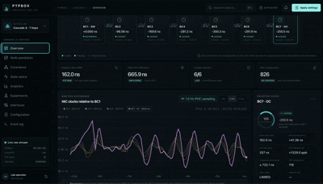
</p>

This capture comes from the running seven-card host. It shows the ordered
BC1→BC7 topology, per-node lock state, direct PHC differences, endpoint
nanosecond RMS, and the unsmoothed BC1-relative trace updating together. The
animated values are live measurements, not a prerecorded simulation dataset.

## See timing error grow, hop by hop

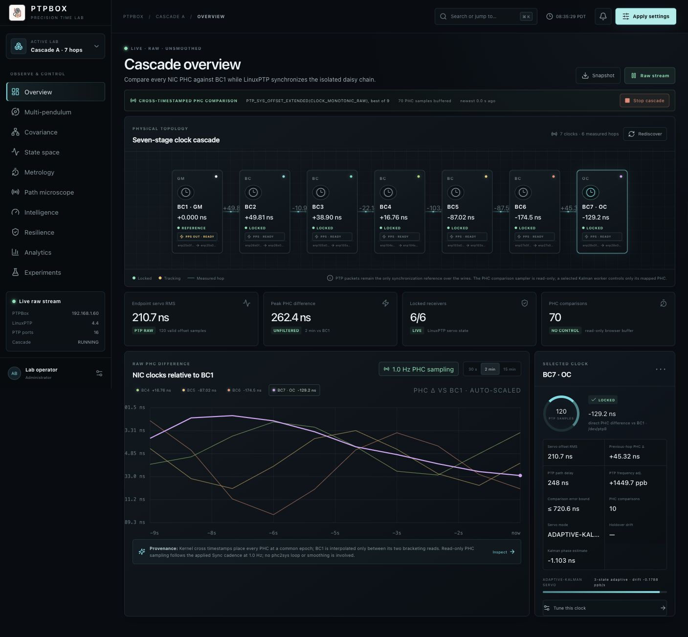

The first viewport is the experiment: BC1 grandmaster to BC7 ordinary clock,
with five boundary clocks in between. Select a node to inspect its direct PHC
difference from BC1, previous-hop delta, raw LinuxPTP servo RMS, path delay,
frequency adjustment, comparison error bound, servo type, and holdover drift.

> [!NOTE]
> Every control-room screenshot in this README was captured from the running
> seven-card reference host. Values are live and will change from sample to
> sample. The traces are not cosmetically smoothed.

## Watch the cascade as a multi-pendulum

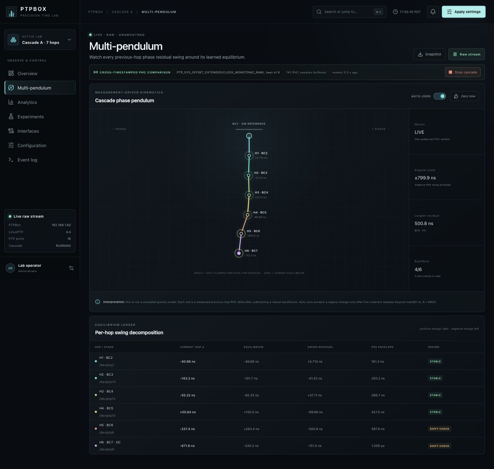

Each rod is one physical hop, from BC2 through BC7. Its angle is the current
previous-hop PHC delta minus a robust learned equilibrium: positive residuals
swing right and negative residuals swing left. The visual scale follows the
P95 swing envelope so nanosecond motion remains legible without smoothing the
measurements. A large coherent phase shift is re-zeroed only after five
confirming samples beyond the adaptive MAD threshold; **Zero now** establishes
an operator-selected equilibrium immediately. The ledger below the pendulum
keeps the raw hop delta, equilibrium, residual, envelope, and regime visible.

This is a measurement mapping, not a gravity simulation. It is designed to make
stable jitter, a changing equilibrium, and downstream amplification apparent at
a glance while preserving the exact values for analysis.

## Find coupled motion and dominant modes

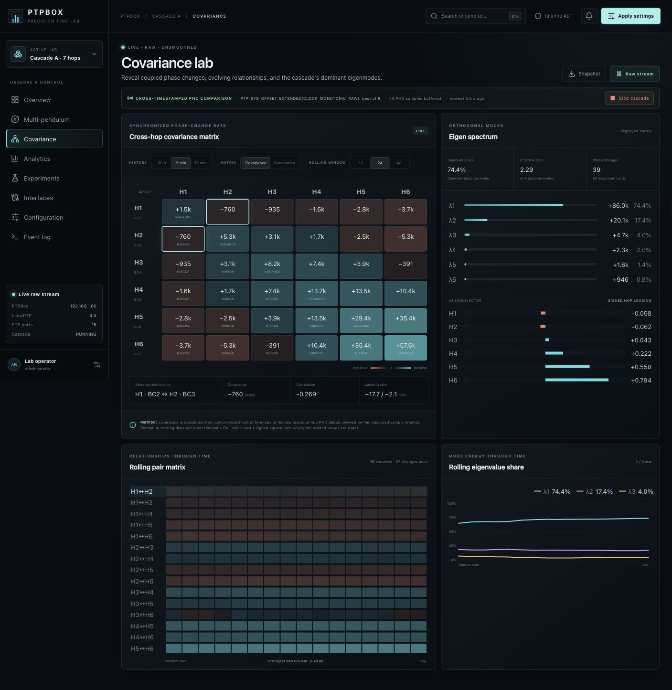

The covariance lab aligns all six previous-hop measurements by their common PHC
comparison cycle, calculates each phase-change rate in ns/s, and analyzes a
selectable 12, 24, or 48-change rolling window. Switch between the dimensional
covariance matrix and normalized correlation, select any hop pair, and follow
all fifteen unique relationships through time. The eigen spectrum shows how
much matrix trace each orthogonal mode explains, while signed λ1 loadings expose
which hops move together and which move against the dominant cascade mode.

The computation uses raw previous-hop differences before visualization
zeroing. Constant equilibrium subtraction therefore cancels naturally and
cannot manufacture correlation.

## Explore the timing system in state space

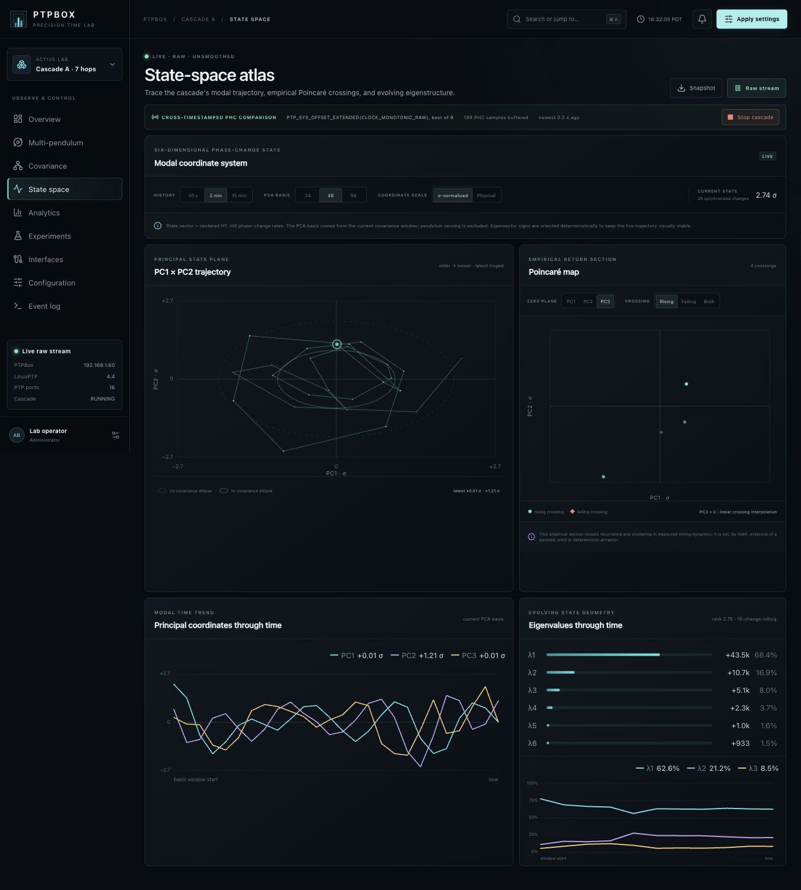

The state-space atlas treats the six synchronized hop-change rates as one
six-dimensional state vector. It centers that vector, builds a covariance PCA
basis, and traces the live PC1×PC2 trajectory against its 1σ and 2σ geometry.
Switch between σ-normalized and physical coordinates, select a 24, 48, or
96-change basis, and inspect rising, falling, or bidirectional crossings through
the PC1, PC2, or PC3 zero plane.

The empirical Poincaré section uses linear interpolation between consecutive
measured states. It is useful for revealing recurrence and clustered return
regions, but the Observatory deliberately does not label those patterns as a
periodic orbit or deterministic attractor without supporting evidence. Modal
time traces and rolling covariance eigenvalues keep the evolving geometry tied
to the original measurements.

## Open the loop in the Holdover chamber

The dedicated Holdover mode turns a manual servo stop into a repeatable
experiment. Select one clock or the downstream chain, choose the qualification
dwell and capture duration, and arm the run. PTPBox first restores every
selected node's saved servo, then requires fresh PHC observations and
continuous LinuxPTP `s2` lock inside the release gate. Any excursion resets the
dwell.

At release, each clock is zeroed against the median of its final qualified
BC1-relative PHC window. Clock adjustment changes to LinuxPTP `free_running 1`;
PTP messages, direct PHC monitoring, and the SQLite recorder continue. The
dominant graph shows unsmoothed accumulated time error from that baseline,
while the node ledger reports current wander, peak magnitude, RMS, raw sample
count, and least-squares rate error. Because 1 ns/s equals 1 ppb, the slope
directly exposes the free-running fractional-frequency error.

The original mixed servo assignment is preserved per node and restored
automatically at the configured duration or immediately with **Resume
synchronization**. Browser refreshes do not lose the run: the state machine is
host-persistent, every raw row remains exportable, and long chart viewports are
uniformly decimated without changing the stored dataset.

## Go beyond an offset graph

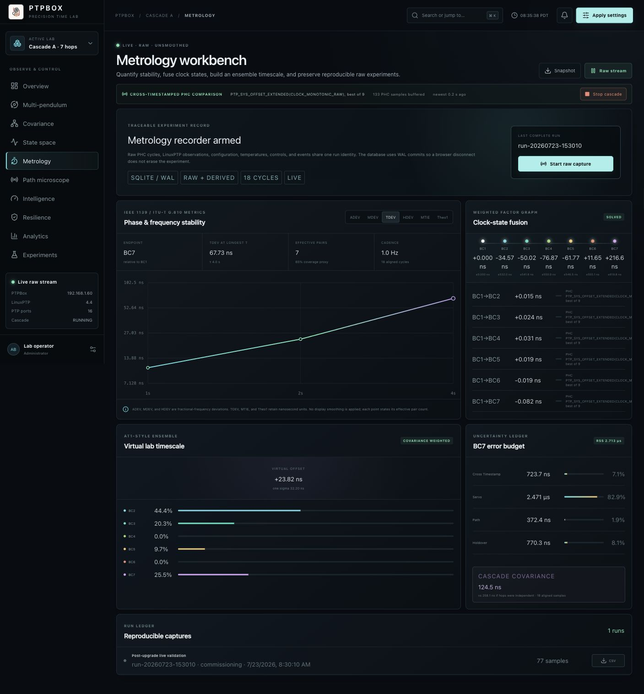

The metrology workbench calculates overlapping ADEV, MDEV, TDEV, HDEV, MTIE,
and Theo1 at power-of-two averaging intervals. It reports the number of usable
pairs with every point and never fills missing live samples. A weighted
least-squares factor graph fuses direct BC1 comparisons, adjacent-hop
constraints, and a common PPS edge when the hardware exposes one. The ensemble
clock uses covariance-regularized inverse weighting, while the error budget
separates cross-timestamp uncertainty, servo noise, observed path motion, and
holdover prediction. Cascade uncertainty is propagated through the measured
hop covariance instead of assuming that every stage is independent.

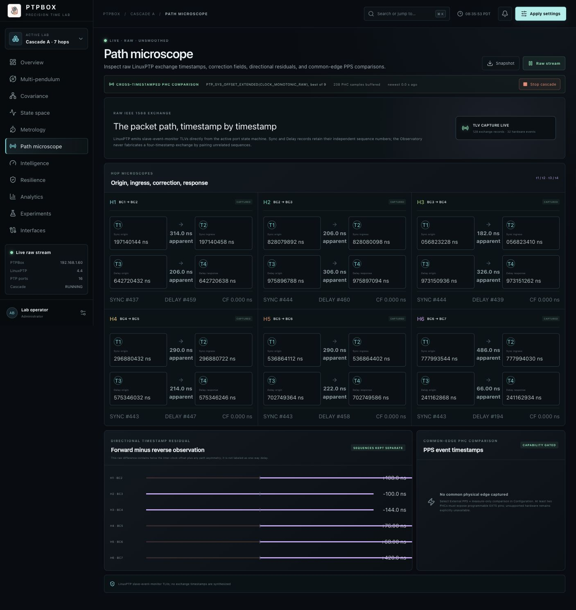

The path microscope records LinuxPTP slave-event-monitor TLVs for every
adjacent Sync/Follow_Up and Delay_Req/Delay_Resp exchange. `t1` through `t4`,
both sequence IDs, and correction fields are retained as decimal strings so
nanosecond precision is not lost to JSON floating point. The directional
timestamp residual is intentionally labeled **apparent**: without a common
external timebase, it contains twice the inter-clock phase offset as well as
path asymmetry. PTPBox does not mislabel that observable as calibrated one-way
delay.

<table>
  <tr>
    <td width="50%">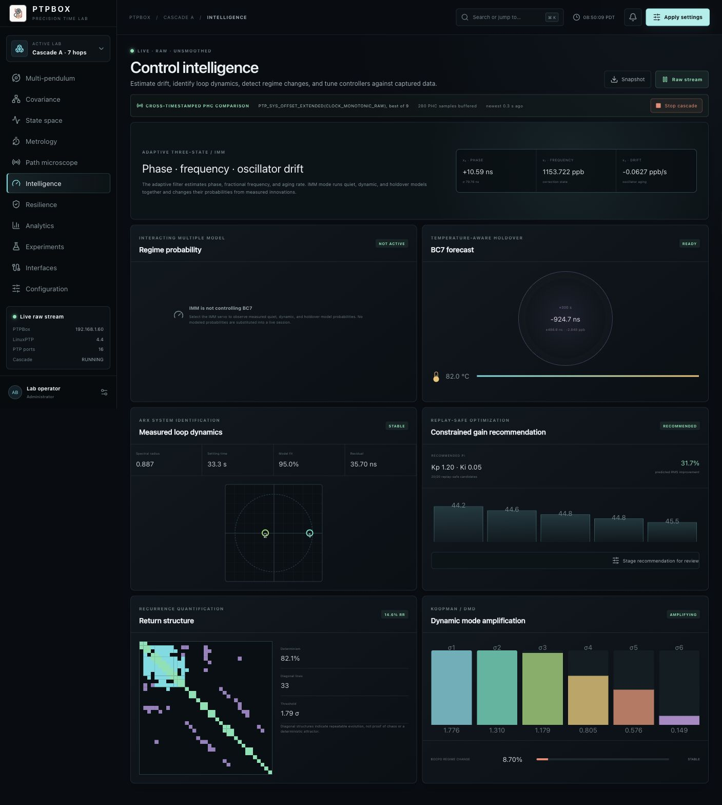</td>
    <td width="50%">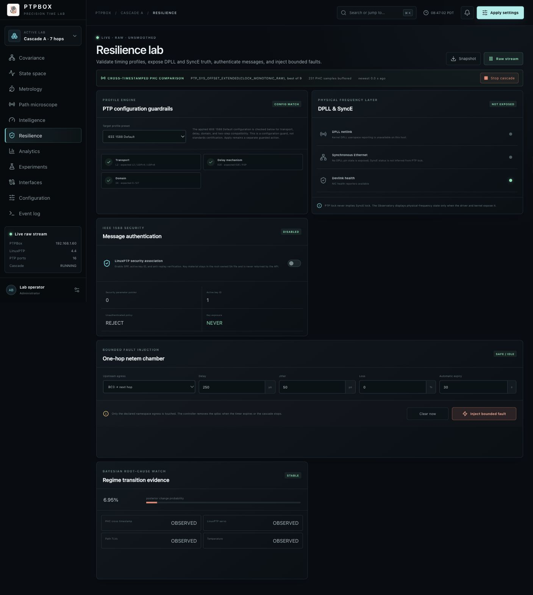</td>
  </tr>
  <tr>
    <td><strong>Control intelligence</strong><br>Three-state adaptive Kalman, interacting multiple models, temperature-aware holdover, ARX identification, replay-only Gaussian-process tuning, PI response bifurcation, recurrence quantification, fractal scaling, Koopman/DMD, and Bayesian online change detection.</td>
    <td><strong>Resilience lab</strong><br>Profile configuration guardrails, capability-gated DPLL/SyncE truth, LinuxPTP Authentication TLVs, and one-hop netem faults with mandatory automatic expiry.</td>
  </tr>
</table>

These panels are estimators and diagnostic instruments, not autonomous
decision makers. Gain optimization evaluates captured samples only and stages a
recommendation for operator review; it never explores gains on the live
cascade. Hardware claims remain capability-gated, and profile checks are
configuration guardrails rather than standards certification.

### Sweep response branches without touching a clock

The nonlinear workbench now moves directly between the recurrence plot and a
gain-parameter bifurcation map. For each multiplier from 0.25× to 2.50×, it
replays the captured endpoint PHC phase through the configured PI gains,
discards controller-state transients, and plots extrema from the settled tail.
The 1.00× configured PI baseline and the first replay safety-bound crossing are
marked on the same axes. When the endpoint is running another servo, such as
adaptive Kalman, the line says **PI baseline** instead of implying that PI is
live. The ledger keeps the active-controller provenance, base gains, settled
RMS, response-band count, and regime visible.

This is intentionally labeled a **replay bifurcation map** and reports
`live_changes: 0`. It is a screening instrument for fixed, multi-band, and
divergent response regions—not proof that the physical clock cascade underwent
a mathematical bifurcation. That stronger claim requires a controlled hardware
gain sweep with adequate dwell and settled observations at every step.

### Measure fractal scaling without inventing a chaos claim

The same nonlinear workbench includes a **Fractal analysis** view with three
complementary finite-record diagnostics:

- **Grassberger–Procaccia correlation dimension \(D_2\)** reconstructs delayed
  endpoint-phase states at embedding dimensions 2 through 5, excludes temporal
  neighbors with a Theiler window, highlights the selected log–log scaling
  interval, and reports whether the estimate actually converges as embedding
  dimension increases.
- **Higuchi graph dimension \(D_H\)** measures the roughness of endpoint phase
  versus sample index and publishes the regression \(R^2\), sample count, and
  maximum interval \(k\). It is deliberately labeled as trace dimension rather
  than attractor dimension.
- **MF-DFA** estimates generalized Hurst exponents from \(q=-4\) through \(q=4\)
  and reports the spectrum width \(\Delta h\). Six deterministic shuffled
  surrogates preserve the phase-value distribution while breaking temporal
  order, helping distinguish correlation-driven width from a broad marginal
  distribution.

Higuchi starts at 32 endpoint samples, correlation dimension at 64, and MF-DFA
at 128. Every value comes from raw captured endpoint PHC phase without
interpolation and reports `live_changes: 0`. A non-integer dimension, high fit
quality, or broad multifractal spectrum is **not by itself evidence of
deterministic chaos, exact self-similarity, or a strange attractor**.

## What you can do

| Surface | Purpose |
| --- | --- |
| **Cascade overview** | See the physically verified topology, direct PHC differences, per-hop deltas, path delay, frequency correction, and servo state. |
| **Multi-pendulum** | Turn every previous-hop PHC residual into a connected rod angle, with robust equilibrium learning, regime-shift auto-zeroing, and a per-hop swing ledger. |
| **Covariance lab** | Compare synchronized phase-change rates as covariance or correlation, follow every pair through time, and inspect eigenvalues plus dominant-mode loadings. |
| **State-space atlas** | Trace the PCA state orbit, extract configurable empirical Poincaré sections, compare physical and σ-normalized coordinates, and follow modal/eigenvalue time trends. |
| **Metrology** | Compute ADEV, MDEV, TDEV, HDEV, MTIE, and Theo1; fuse redundant offset constraints; build an ensemble clock; and propagate a covariance-aware error budget. |
| **Path microscope** | Inspect preserved `t1`/`t2`/`t3`/`t4` exchange timestamps, correction fields, independent sequence IDs, and scientifically qualified directional residuals. |
| **Control intelligence** | Estimate phase/frequency/drift, switch among quiet/dynamic/holdover models, predict thermal holdover, identify loop dynamics, detect changes, rank replay-safe PI gains, inspect settled response branches, and compare correlation, Higuchi, and multifractal scaling. |
| **Holdover chamber** | Qualify continuous lock, capture a per-node release baseline, stop adjustment without stopping observation, plot raw wander, report rate error, and restore the exact saved servos. |
| **Resilience lab** | Validate profile preset fields, expose kernel DPLL/SyncE state without inference, configure message authentication, and inject automatically expiring one-hop faults. |
| **Analytics** | Compare unsmoothed read-only PHC measurements, inspect the endpoint distribution, and export raw timestamped samples. |
| **Durable experiments** | Capture configuration and raw PHC samples in a SQLite/WAL run ledger, stop without losing data, and export an immutable CSV by run ID. |
| **Servo & holdover control** | Select native PI/linear-regression/null-frequency discipline, classic Kalman, adaptive phase/frequency/drift Kalman, or quiet/dynamic/holdover IMM per clock; change discipline while read-only monitoring stays live. |
| **PPS & `ts2phc` control** | Select a PHC or external PPS source, configure pins and `ts2phc`, or compare two or more PHCs against one physical PPS edge in strictly measurement-only mode. |
| **Lifecycle control** | Start or stop the real namespace cascade from the UI after the guarded host helper is installed. |
| **Hardware inventory** | Discover NICs, PCI addresses, drivers, link rates, PHCs, and hardware timestamping capability. |
| **Notifications & event stream** | Follow measurement health, lock state, active servo mix, threshold events, and operator actions. |
| **Command palette** | Press <kbd>⌘ K</kbd> or <kbd>Ctrl K</kbd> to search every observatory page, clock, measurement surface, and live control, then open it without leaving the keyboard. |
| **Demo mode** | Use an explicitly labeled deterministic fallback only when the live agent is unavailable. |

## Product tour

<table>
  <tr>
    <td width="50%"></td>
    <td width="50%"></td>
  </tr>
  <tr>
    <td><strong>Stability analytics</strong><br>Raw trace selection, endpoint density, window RMS, frequency correction, and CSV export.</td>
    <td><strong>Repeatable experiments</strong><br>Step response, holdover, wander, and gain-sweep recipes.</td>
  </tr>
</table>

<table>
  <tr>
    <td width="50%">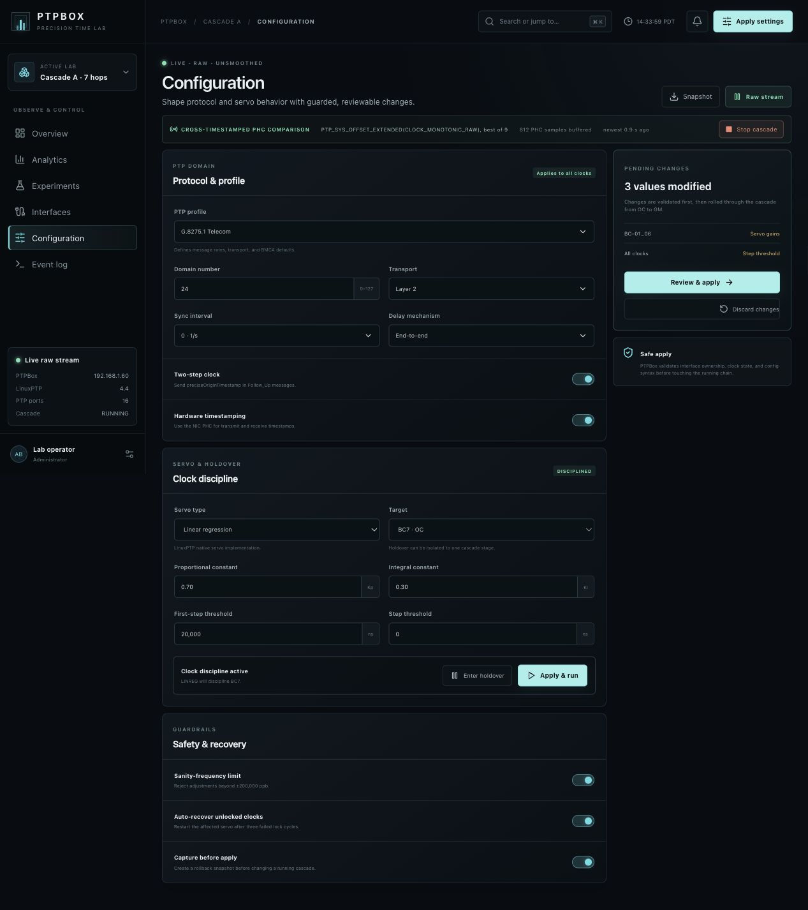</td>
    <td width="50%">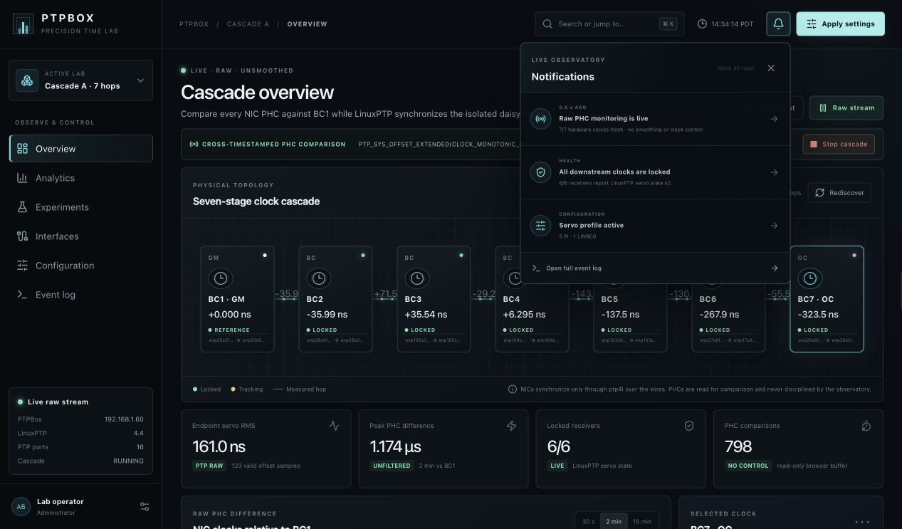</td>
  </tr>
  <tr>
    <td><strong>Servo and holdover control</strong><br>Choose PI, linear regression, null frequency, classic Kalman, adaptive phase/frequency/drift Kalman, or IMM for one stage or the downstream chain. Enter holdover while raw monitoring continues.</td>
    <td><strong>Live notification center</strong><br>See PHC freshness, receiver lock health, and the active servo mix, then jump directly to the relevant control-room surface.</td>
  </tr>
</table>


The inventory above is read from the host: sixteen PTP-capable ports, fourteen
active 100G timing links, PHC device providers, PCI functions, drivers, and
hardware timestamp capability.

## Two ways to run it

### 1. Observer / demo mode — no root required

This serves the complete UI, discovers the host, reads LinuxPTP logs, and stages
configuration without moving interfaces or starting privileged processes.

```bash
git clone https://github.com/ahmadexp/PTPBox.git
cd PTPBox
npm ci
npm run build:standalone

PTPBOX_ROOT="$PWD" \
PTPBOX_WEB_ROOT="$PWD/dist-standalone" \
python3 agent/ptpbox_agent.py
```

Open [http://localhost:8090](http://localhost:8090). If the agent cannot find
live measurements, the Observatory labels itself as a hardware model and keeps
every visualization interactive.

### 2. Full host integration — physical cascade

```bash
# 1. Map this machine's PTP ports and protect its management links.
$EDITOR agent/topology.json

# 2. Build, install, and start the persistent web agent.
npm ci
npm run build:standalone
sudo PTPBOX_USER="$(id -un)" PTPBOX_ROOT="$PWD" bash scripts/install-host.sh

# 3. Validate before moving any NIC.
sudo ptpboxctl discover
sudo ptpboxctl status

# 4. Start from the CLI, or use Start cascade in the Observatory.
sudo ptpboxctl start
```

The UI is then available at `http://<ptpbox-host>:8090`. See the complete
[installation and upgrade guide](docs/INSTALLATION.md) before starting the data
plane.

## Architecture

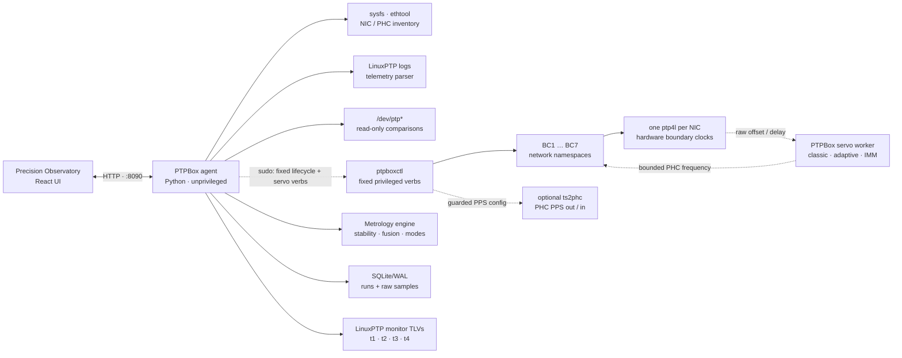

The agent runs as the operator, not root. Observation stays unprivileged.
Lifecycle, servo, and bounded-fault control cross a narrow sudo boundary that
accepts six fixed operations and no arbitrary command line. See
[Architecture](docs/ARCHITECTURE.md) and [Security](SECURITY.md).

The Configuration page also exposes a safe-off-by-default PPS lab: select a PHC
source or external PPS, choose PPS input clocks, pins, edge, pulse width, phase,
correction, and the `ts2phc` servo. Apply validates the real periodic-output and
external-timestamp capabilities before a managed process is started. The
Overview reports each clock's actual PPS role, connector function, and runtime
state from sysfs and the managed process table.

## What gets measured

- Common-epoch PHC difference for each NIC relative to BC1, using the best of
  nine kernel cross timestamps and an interpolated BC1 reference, sampled at
  the applied 0.5–8 Hz protocol-valid Sync cadence
- Raw LinuxPTP servo-offset RMS in nanoseconds, separate from PHC comparison
  dispersion and its reported error bound
- Overlapping ADEV, MDEV, TDEV, HDEV, MTIE, and Theo1 across supported
  averaging intervals, including usable-pair counts
- Read-only previous-hop delta and cumulative cascade error
- LinuxPTP master offset, mean path delay, and frequency adjustment
- Preserved `t1`/`t2`/`t3`/`t4` timestamp-exchange records and qualified
  apparent directional residuals
- Classic and adaptive Kalman phase/frequency/drift estimates,
  covariance-derived uncertainty, innovation acceptance, rejected-sample
  count, and applied bounded correction
- IMM quiet/dynamic/holdover probabilities and the active regime
- Temperature-aware holdover prediction with uncertainty
- ARX loop model, poles, spectral radius, fit, residual, and settling estimate
- Replay-only Gaussian-process PI recommendation with the evaluated safe
  frontier and zero live exploratory changes
- Lock/tracking state and recovery events
- Holdover qualification progress, per-node release baselines, elapsed
  free-run time, current/peak/RMS wander, and frequency drift from the
  continuing raw PHC trace
- Offset distribution, P95, skew, and contribution share
- Weighted factor-graph residuals, covariance-regularized ensemble weights,
  and correlated-versus-independent cascade uncertainty
- Rolling phase-change covariance/correlation, full pair timelines, eigenvalues,
  explained trace, effective rank, and dominant eigenvector loadings
- Six-dimensional state-space projections, covariance ellipses, empirical
  Poincaré crossings, modal coordinates, and rolling eigenvalue shares
- Recurrence rate/determinism, Koopman/DMD amplification, and Bayesian online
  change probability
- NIC carrier, speed, driver, PCI bus, PHC, and timestamp capability
- Per-node PPS availability, configured in/out role, live PHC pin function,
  channel, connector, and managed `ts2phc` state
- Experiment metadata, servo constants, and capture lifecycle

The live agent reads mapped PHCs without changing them and separately parses
native LinuxPTP output. Missing data is never silently presented as live; the
UI switches to its deterministic hardware-model mode.

## What “raw” means

When the Observatory says **LIVE · RAW · UNSMOOTHED**, the plotted points come
from the installed machine. Each PHC comparison uses Linux
`PTP_SYS_OFFSET_EXTENDED` cross timestamps and selects the lowest-error reading
from a nine-sample measurement burst. That improves the error bound of one
measurement; it does not average or smooth the time series.

Servo RMS is calculated separately from native LinuxPTP master-offset samples
reported by `ptp4l`. The UI never substitutes PHC-comparison dispersion for
servo RMS. During holdover, observation continues while only the selected clock
discipline is disabled, so drift remains measurable. If either raw source is
missing or stale, the interface says so instead of manufacturing a live value.

The path microscope is raw in a different sense: it preserves the exchange
timestamps exported by LinuxPTP's event monitor. Its apparent forward/reverse
residual is not a one-way path calibration because the two PHCs are not already
on a common timebase. A shared external PPS edge can provide an independent
multi-PHC comparison when the NICs expose external-timestamp pins, but it also
remains read-only.

## Hardware

The current reference host uses seven dual-port ConnectX-6 Dx adapters with all
fourteen timing links at 100G, plus a separate Intel X550 management adapter.
Each timing adapter is isolated in its own namespace.
PTPBox never hides a split-clock card with a local synchronization loop: if its
ports do not share or hardware-synchronize a PHC, the direct comparison exposes
that difference as part of the experiment.

ConnectX cards must have device-wide real-time clock mode enabled and loaded by
a supported firmware reset. The [hardware guide](docs/HARDWARE.md) includes the
verified setting, reset sequence, current PCI/PHC map, and cable-probe workflow.

<table>
  <tr>
    <td width="48%"></td>
    <td width="52%"></td>
  </tr>
  <tr>
    <td><strong>The original seven-NIC PTPBox host</strong></td>
    <td><strong>The original namespace cascade concept</strong></td>
  </tr>
</table>

Read the [hardware and topology guide](docs/HARDWARE.md) for discovery commands,
shared-PHC behavior, interface mapping, and a preflight checklist.

## Repository map

```text
app/                 Precision Observatory UI
agent/               Read-only host API, topology, systemd template
scripts/             Safe lifecycle, install, and uninstall helpers
standalone/          Static-host entrypoint for the on-box agent
docs/                Installation, research, architecture, API, hardware, experiments
tests/               Rendered-product checks
.github/workflows/   CI for UI, Python, shell, and standalone builds
```

## Development

```bash
npm ci
npm run dev          # local application server
make check           # lint, tests, both builds, Python and shell validation
```

The main application uses React 19, TypeScript, Vinext/Vite, and Canvas-based
telemetry charts. The host agent uses only the Python standard library.

## Project status

The complete Precision Observatory is running on the seven-NIC reference host:
the ordered namespace cascade, common-epoch PHC comparison, raw LinuxPTP
telemetry, selectable native/Kalman/adaptive/IMM servos, measured holdover,
packet-path capture, stability metrology, factor fusion, ensemble time,
covariance-aware error budgets, nonlinear-dynamics diagnostics, guarded
profiles/security/faults, PPS common-edge comparison, and durable experiment
storage are implemented. Hardware-dependent instruments say **not exposed**
instead of inferring state when the driver or kernel lacks the required API.
See [CHANGELOG.md](CHANGELOG.md).

## Research foundations

The implementations are dependency-free and intentionally compact so they can
run on the appliance, but their definitions and operational boundaries follow
primary references:

- [NIST SP 1065, *Handbook of Frequency Stability Analysis*](https://www.nist.gov/publications/handbook-frequency-stability-analysis)
  for Allan-family, time-deviation, MTIE, and Theo statistics;
- [Linux kernel PTP hardware clock infrastructure](https://docs.kernel.org/driver-api/ptp.html)
  for PHC clocks, cross timestamps, EXTS, and periodic outputs;
- [Linux kernel DPLL subsystem](https://docs.kernel.org/driver-api/dpll.html)
  for capability-gated physical-frequency state;
- [LinuxPTP servo configuration](https://www.linuxptp.org/documentation/default/)
  and [`ts2phc`](https://www.linuxptp.org/documentation/ts2phc/) for native
  servos, PPS, and Authentication TLVs;
- [NIST, *Steering a Time Scale*](https://www.nist.gov/publications/steering-time-scale)
  for weighted ensemble-clock design;
- [Adams and MacKay, *Bayesian Online Changepoint Detection*](https://arxiv.org/abs/0710.3742)
  for causal regime-change probability;
- [Schmid, *Dynamic Mode Decomposition of Numerical and Experimental Data*](https://doi.org/10.1017/S0022112010001217)
  for the snapshot-based dynamics operator;
- [Snoek, Larochelle, and Adams, *Practical Bayesian Optimization*](https://papers.nips.cc/paper_files/paper/2012/hash/05311655a15b75fab86956663e1819cd-Abstract.html)
  for Gaussian-process expected-improvement search.

See [Architecture](docs/ARCHITECTURE.md) for the exact implementation and
interpretation limits.

## Heritage

This project modernizes the public
[Time Appliances Project PTPBox prototype](https://github.com/Time-Appliances-Project/Incubation-Projects/tree/master/Software/PTPBox),
created by Ahmad Byagowi. The namespace architecture, seven-node cascade, and
hardware photographs come from that work.

## Contributing

Bug reports, hardware profiles, measurement ideas, and UI improvements are
welcome. Start with [CONTRIBUTING.md](CONTRIBUTING.md) and keep hardware safety
front and center. Contributions grant Ahmad Byagowi the right to incorporate
and commercially license the submitted work as part of PTPBox; see the
contribution terms before submitting.

## License

PTPBox is source-available under the
[PTPBox Noncommercial Source License 1.0](LICENSE).

You may use, study, modify, and redistribute PTPBox for noncommercial purposes,
subject to the license terms. **Any commercial use requires prior, express
written approval from Ahmad Byagowi.** The author reserves all commercial
rights exclusively; an approved third-party use is only a limited exception
within the scope of its written agreement.

© 2026 Ahmad Byagowi. All rights reserved except as stated in the license.
