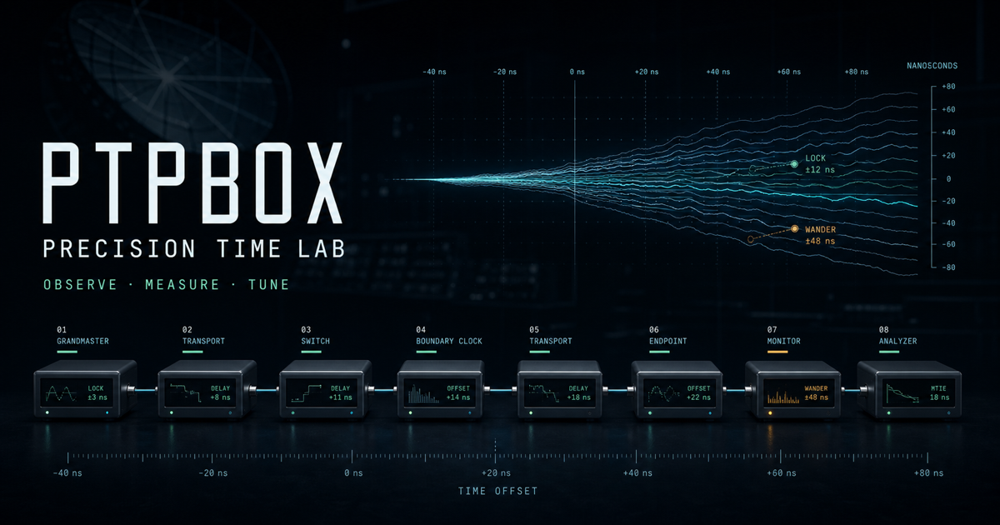
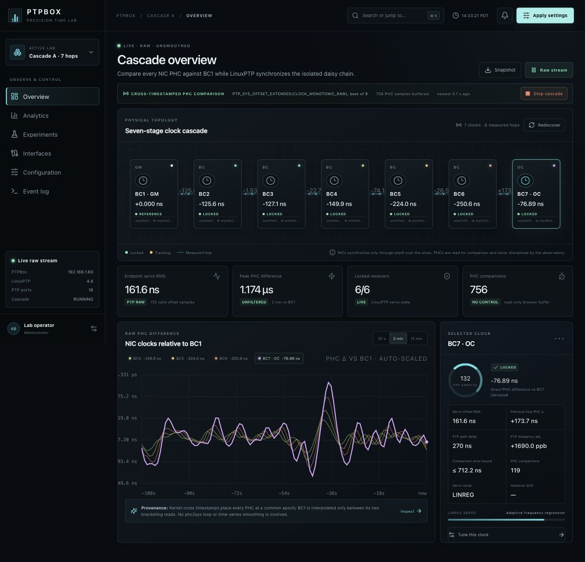
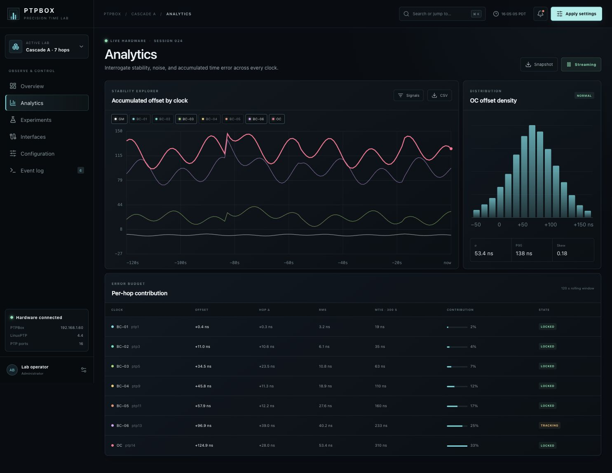
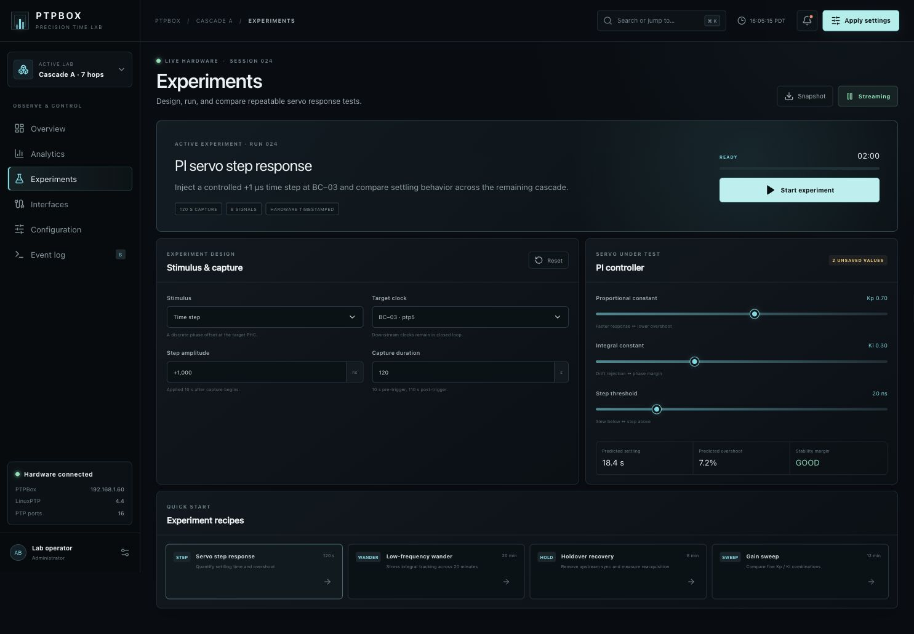
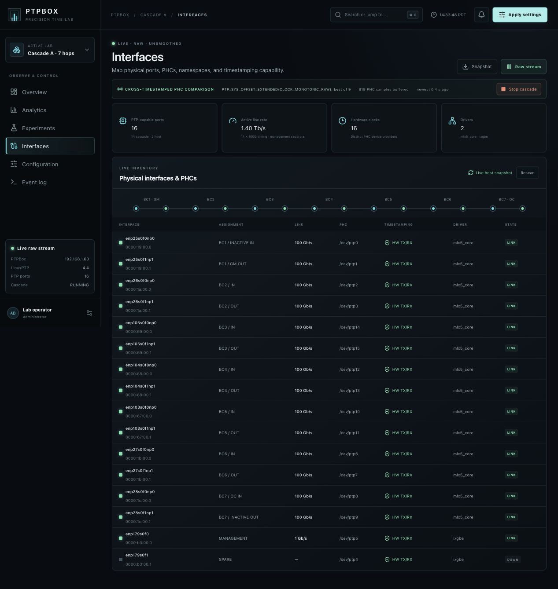
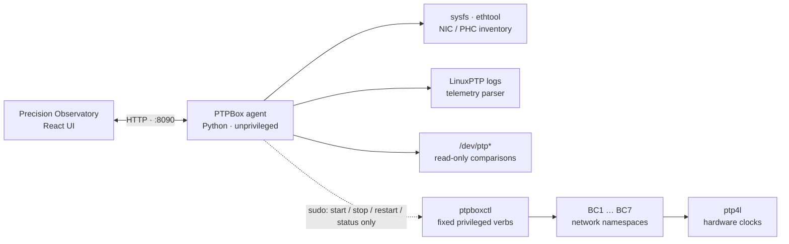
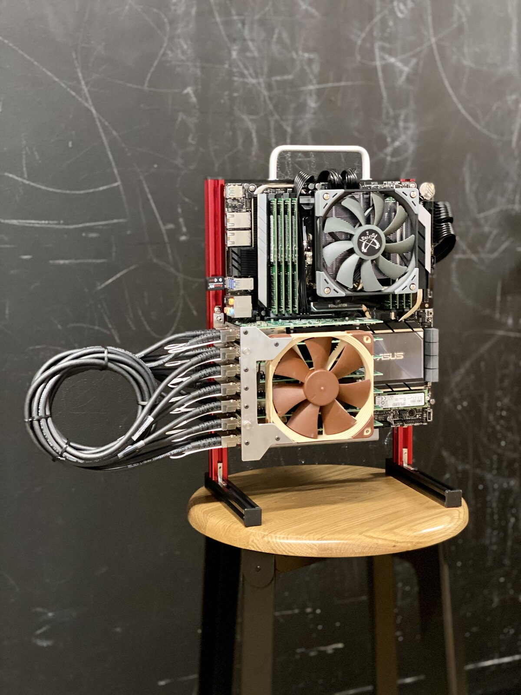
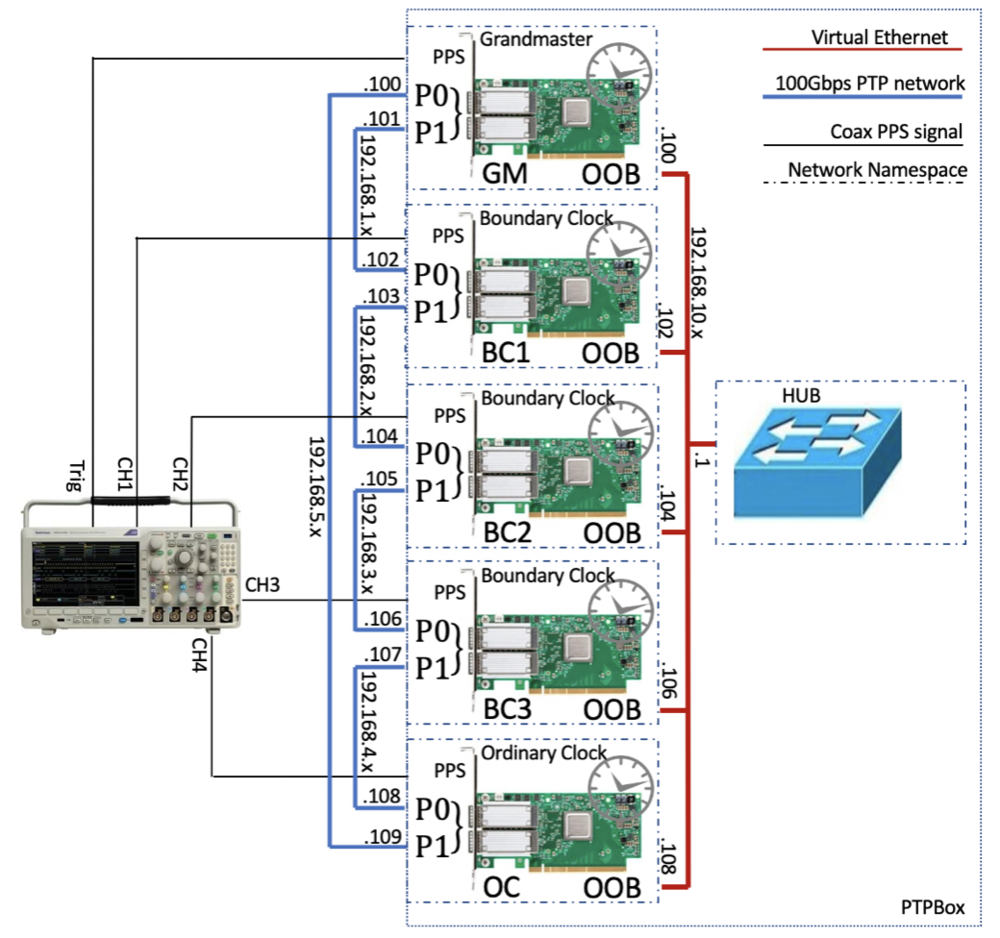

<div align="center">



# PTPBox

### Precision Time Lab

**Build an entire PTP cascade inside one multi-NIC Linux host. Observe every hop. Measure accumulated error. Tune the servo. Repeat.**

[](https://github.com/ahmadexp/PTPBox/actions/workflows/ci.yml)
[](LICENSE)
[](https://linuxptp.nwtime.org/)
[](package.json)
[](agent/ptpbox_agent.py)

[Live demo](https://ptpbox-precision-lab.turbalance-3786.chatgpt.site) · [Install](docs/INSTALLATION.md) · [Architecture](docs/ARCHITECTURE.md) · [Hardware guide](docs/HARDWARE.md) · [API](docs/API.md)

</div>

---

PTPBox is a modern revival of the original namespace-based PTPBox experiment.
It uses physical NICs, Linux network namespaces, LinuxPTP, and hardware PHCs to
turn one server into a chain of isolated clocks. The Precision Observatory adds
the control room the project always deserved: live topology, offset traces,
per-hop error budgets, repeatable experiments, hardware inventory, guarded
configuration, and an explicit simulation fallback for demos.

> [!IMPORTANT]
> The web UI is safe to explore immediately. Starting the physical cascade moves
> the NICs declared in `agent/topology.json` into network namespaces. Review that
> file carefully and keep every management interface in
> `management_interfaces` before running `ptpboxctl setup` or `start`.

## See timing error grow, hop by hop



The first viewport is the experiment: GM to OC, measured one hardware clock at
a time. Select any node to isolate its direct PHC difference from BC1, per-hop
PHC delta, LinuxPTP path delay, frequency adjustment, and servo state.

## What you can do

| Surface | Purpose |
| --- | --- |
| **Cascade overview** | See the physically verified topology, direct PHC differences, per-hop deltas, path delay, frequency correction, and servo state. |
| **Analytics** | Compare unsmoothed read-only PHC measurements, inspect the endpoint distribution, and export raw timestamped samples. |
| **Experiments** | Run step, wander, holdover, and gain-sweep recipes with reproducible capture settings. |
| **Servo tuning** | Adjust PI gains and thresholds, preview behavior, validate, stage, and roll changes through the chain. |
| **Hardware inventory** | Discover NICs, PCI addresses, drivers, link rates, PHCs, and hardware timestamping capability. |
| **Event stream** | Follow clock-state transitions, measurement windows, threshold events, and operator actions. |
| **Demo mode** | Use an explicitly labeled deterministic fallback only when the live agent is unavailable. |

## Product tour

<table>
  <tr>
    <td width="50%"></td>
    <td width="50%"></td>
  </tr>
  <tr>
    <td><strong>Stability analytics</strong><br>Raw trace selection, endpoint density, window RMS, frequency correction, and CSV export.</td>
    <td><strong>Repeatable experiments</strong><br>Step response, holdover, wander, and gain-sweep recipes.</td>
  </tr>
</table>



## Two ways to run it

### 1. Observer / demo mode — no root required

This serves the complete UI, discovers the host, reads LinuxPTP logs, and stages
configuration without moving interfaces or starting privileged processes.

```bash
git clone https://github.com/ahmadexp/PTPBox.git
cd PTPBox
npm ci
npm run build:standalone

PTPBOX_ROOT="$PWD" \
PTPBOX_WEB_ROOT="$PWD/dist-standalone" \
python3 agent/ptpbox_agent.py
```

Open [http://localhost:8090](http://localhost:8090). If the agent cannot find
live measurements, the Observatory labels itself as a hardware model and keeps
every visualization interactive.

### 2. Full host integration — physical cascade

```bash
# 1. Map this machine's PTP ports and protect its management links.
$EDITOR agent/topology.json

# 2. Build, install, and start the persistent web agent.
npm ci
npm run build:standalone
sudo PTPBOX_USER="$(id -un)" PTPBOX_ROOT="$PWD" bash scripts/install-host.sh

# 3. Validate before moving any NIC.
sudo ptpboxctl discover
sudo ptpboxctl status
```

The UI is then available at `http://<ptpbox-host>:8090`. See the complete
[installation and upgrade guide](docs/INSTALLATION.md) before starting the data
plane.

## Architecture



The agent runs as the operator, not root. Observation stays unprivileged.
Lifecycle control crosses a narrow sudo boundary that accepts four fixed
commands and no arbitrary arguments. See [Architecture](docs/ARCHITECTURE.md)
and [Security](SECURITY.md).

## What gets measured

- Direct PHC difference and PHC RMS for each NIC relative to BC1
- Read-only previous-hop delta and cumulative cascade error
- LinuxPTP master offset, mean path delay, and frequency adjustment
- Lock/tracking state and recovery events
- MTIE windows and mask verdicts
- Offset distribution, P95, skew, and contribution share
- NIC carrier, speed, driver, PCI bus, PHC, and timestamp capability
- Experiment metadata, servo constants, and capture lifecycle

The live agent reads mapped PHCs without changing them and separately parses
native LinuxPTP output. Missing data is never silently presented as live; the
UI switches to its deterministic hardware-model mode.

## Hardware

The reference host uses seven dual-port timing-capable adapters for the cascade
plus separate management ports. Each adapter is isolated in its own namespace.
PTPBox never hides a split-clock card with a local synchronization loop: if its
ports do not share or hardware-synchronize a PHC, the direct comparison exposes
that difference as part of the experiment.

<table>
  <tr>
    <td width="48%"></td>
    <td width="52%"></td>
  </tr>
  <tr>
    <td><strong>The original seven-NIC PTPBox host</strong></td>
    <td><strong>The original namespace cascade concept</strong></td>
  </tr>
</table>

Read the [hardware and topology guide](docs/HARDWARE.md) for discovery commands,
shared-PHC behavior, interface mapping, and a preflight checklist.

## Repository map

```text
app/                 Precision Observatory UI
agent/               Read-only host API, topology, systemd template
scripts/             Safe lifecycle, install, and uninstall helpers
standalone/          Static-host entrypoint for the on-box agent
docs/                Installation, architecture, API, hardware, experiments
tests/               Rendered-product checks
.github/workflows/   CI for UI, Python, shell, and standalone builds
```

## Development

```bash
npm ci
npm run dev          # local application server
make check           # lint, tests, both builds, Python and shell validation
```

The main application uses React 19, TypeScript, Vinext/Vite, and Canvas-based
telemetry charts. The host agent uses only the Python standard library.

## Project status

The Observatory, direct incremental PHC comparison pipeline, raw LinuxPTP servo
telemetry, standalone host, inventory agent, configuration staging, and guarded
lifecycle controller are implemented. The next milestones are durable
experiment storage, PPS comparison datasets, automated MTIE/TDEV/Allan
deviation, and reusable topology presets. See [CHANGELOG.md](CHANGELOG.md).

## Heritage

This project modernizes the public
[Time Appliances Project PTPBox prototype](https://github.com/Time-Appliances-Project/Incubation-Projects/tree/master/Software/PTPBox),
created by Ahmad Byagowi. The namespace architecture, seven-node cascade, and
hardware photographs come from that work.

## Contributing

Bug reports, hardware profiles, measurement ideas, and UI improvements are
welcome. Start with [CONTRIBUTING.md](CONTRIBUTING.md) and keep hardware safety
front and center.

## License

[MIT](LICENSE) © 2026 Ahmad Byagowi.
