<div align="center">


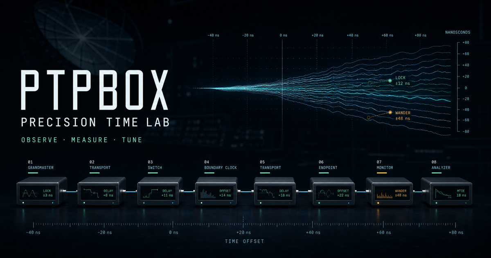

# PTPBox

### Precision Observatory

**Build a real PTP cascade inside one multi-NIC Linux host. Observe every hop. Compare every PHC. Change servos live. Measure holdover. Repeat.**

[](https://github.com/ahmadexp/PTPBox/actions/workflows/ci.yml)
[](LICENSE)
[](https://linuxptp.nwtime.org/)
[](package.json)
[](agent/ptpbox_agent.py)

[Hosted demo](https://ptpbox-precision-lab.turbalance-3786.chatgpt.site) · [Install](docs/INSTALLATION.md) · [Research](docs/RESEARCH.md) · [Architecture](docs/ARCHITECTURE.md) · [Hardware](docs/HARDWARE.md) · [Experiments](docs/EXPERIMENTS.md) · [API](docs/API.md)

</div>

---

PTPBox is a modern revival of the original namespace-based timing experiment.
It turns one Linux server into a physical chain of isolated PTP clocks using
real NICs, one network namespace per card, one `ptp4l` boundary clock per stage,
and a separate read-only PHC comparison process. The Precision Observatory is
the control room: live topology, raw timing traces, per-hop error, selectable
servos, measured holdover, hardware-backed PPS/`ts2phc` experiments, hardware
inventory, notifications, and guarded start/stop control.
Every graph can also be captured as a timestamped PNG and collected in a
shared, accessible Observatory album.

The reference system is not a simulation: seven NVIDIA ConnectX-6 Dx adapters
provide fourteen 100G timing ports, with a separate Intel X550 management link.
The same application can still run in an explicitly labeled hardware-model mode
when a live agent is unavailable.

> [!IMPORTANT]
> The web UI is safe to explore immediately. Starting the physical cascade moves
> the NICs declared in `agent/topology.json` into network namespaces. Review that
> file carefully and keep every management interface in
> `management_interfaces` before running `ptpboxctl setup` or `start`.

## Watch the live Observatory

<p align="center">
  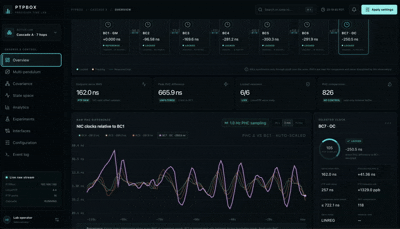
</p>

This capture comes from the running seven-card host. It shows the ordered
BC1→BC7 topology, per-node lock state, direct PHC differences, endpoint
nanosecond RMS, and the unsmoothed BC1-relative trace updating together. The
animated values are live measurements, not a prerecorded simulation dataset.

The main trace offers two scientifically equivalent views of the same raw
record. **Stable view** uses a robust scale for the latest contiguous sampling
regime, keeps relock excursions as edge markers, and shades acquisition gaps.
**Full range** fits every raw value, including startup and grandmaster-reselection
transients. The badge reports achieved/requested collector cadence so a sparse
trace cannot be mistaken for smooth clock behavior.

## See timing error grow, hop by hop

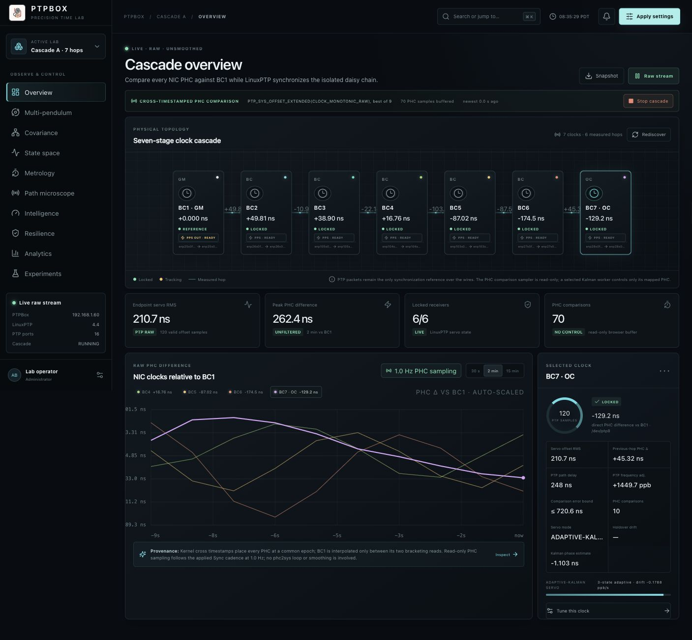

The first viewport is the experiment: BC1 grandmaster to BC7 ordinary clock,
with five boundary clocks in between. Select a node to inspect its direct PHC
difference from BC1, previous-hop delta, raw LinuxPTP servo RMS, path delay,
frequency adjustment, comparison error bound, servo type, and holdover drift.

> [!NOTE]
> Every control-room screenshot in this README was captured from the running
> seven-card reference host. Values are live and will change from sample to
> sample. The traces are not cosmetically smoothed.

## Capture graph evidence

Every graph panel has a **Capture** action. A capture preserves the complete
instrument panel—not just its plotted pixels—so the graph title, evidence
labels, operating mode, and timestamp travel with the image. Captures are
written to the PTPBox host and appear for every connected operator in the
**Album** page, where they can be opened full-size, downloaded as PNG files, or
deleted.

When a hosted or development UI cannot reach the appliance album, the same
action falls back to browser-local IndexedDB and labels the image **This
browser**. Host and local captures are presented together in chronological
order without confusing one storage location for the other.

## Watch the cascade as a multi-pendulum

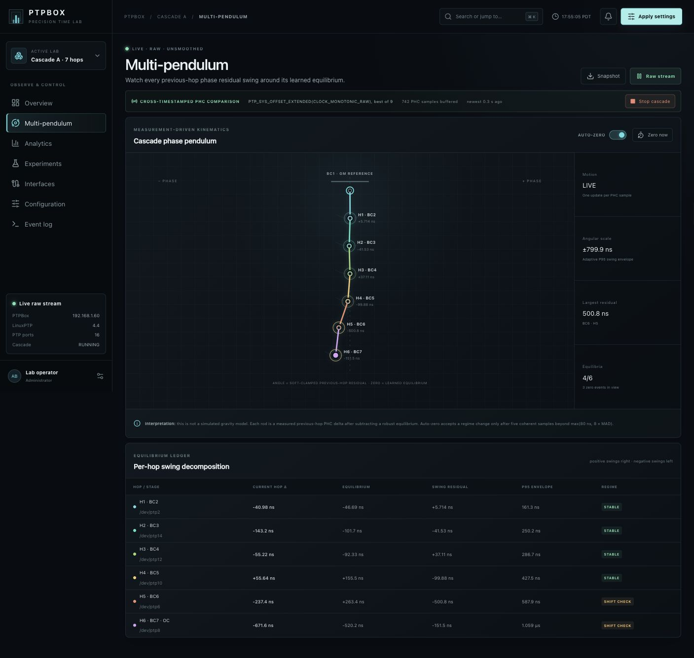

Each rod is one physical hop, from BC2 through BC7. Its angle is the current
previous-hop PHC delta minus a robust learned equilibrium: positive residuals
swing right and negative residuals swing left. The visual scale follows the
P95 swing envelope so nanosecond motion remains legible without smoothing the
measurements. A large coherent phase shift is re-zeroed only after five
confirming samples beyond the adaptive MAD threshold; **Zero now** establishes
an operator-selected equilibrium immediately. The ledger below the pendulum
keeps the raw hop delta, equilibrium, residual, envelope, and regime visible.

This is a measurement mapping, not a gravity simulation. It is designed to make
stable jitter, a changing equilibrium, and downstream amplification apparent at
a glance while preserving the exact values for analysis.

## Find coupled motion and dominant modes

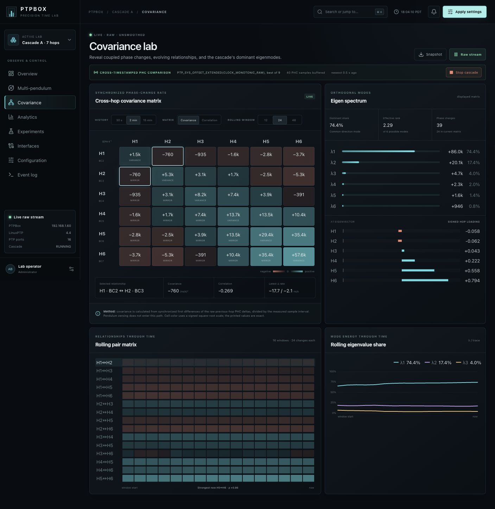

The covariance lab aligns all six previous-hop measurements by their common PHC
comparison cycle, calculates each phase-change rate in ns/s, and analyzes a
selectable 12, 24, or 48-change rolling window. Switch between the dimensional
covariance matrix and normalized correlation, select any hop pair, and follow
all fifteen unique relationships through time. The eigen spectrum shows how
much matrix trace each orthogonal mode explains, while signed λ1 loadings expose
which hops move together and which move against the dominant cascade mode.

The computation uses raw previous-hop differences before visualization
zeroing. Constant equilibrium subtraction therefore cancels naturally and
cannot manufacture correlation.

## Search for attractors in measured timing dynamics

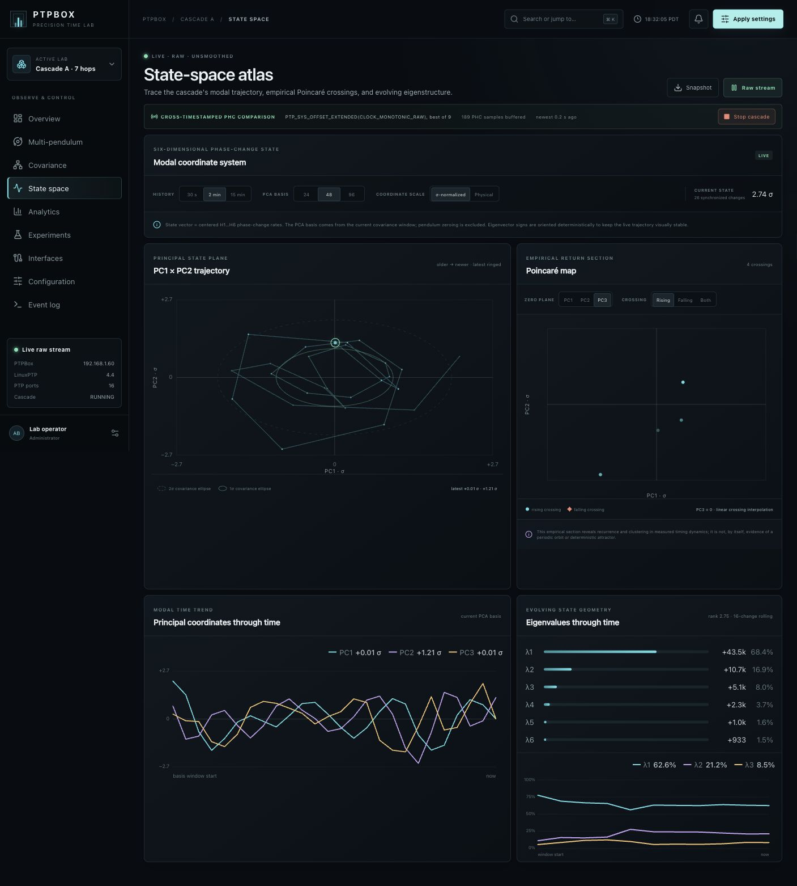

The Attractor Observatory reconstructs hidden state from the raw endpoint PHC
offset using Takens delay coordinates. It chooses the delay from the first local
minimum of average mutual information, falling back to the autocorrelation
1/e crossing when the finite record has no usable minimum. A false-nearest-
neighbor curve then selects the smallest sufficient embedding dimension. The
main trajectory shows `x(t)` against `x(t − τ)`, preserves sample order, encodes
local occupancy, and marks repeatedly visited high-density regions as
**recurrent-core candidates**.

The page does not turn a visually appealing orbit into a chaos claim. Its
evidence ledger independently checks embedding sufficiency, recurrent geometry,
Grassberger–Procaccia correlation-dimension convergence, a Rosenstein-style
early-time local-divergence fit, and stationarity of the current regime. The
stronger “candidate attractor” label appears only when all five gates agree. A successive-maxima
return map, the empirical multivariate Poincaré section, modal time traces, and
rolling covariance eigenvalues remain visible so apparent structure can be
cross-checked against the six-hop dynamics.

The live path uses at most the latest 384 raw endpoint samples, standardizes
only the reconstruction coordinates, excludes temporally adjacent neighbors
with a Theiler window, performs no interpolation, writes no clock, and reports
the complete method and finite-record limitations through `/api/research`.
The implementation follows the original work on
[delay-coordinate reconstruction](https://doi.org/10.1007/BFb0091924),
[average-mutual-information lag selection](https://doi.org/10.1103/PhysRevA.33.1134),
[false nearest neighbors](https://doi.org/10.1103/PhysRevA.45.3403), and
[small-record Lyapunov estimation](https://doi.org/10.1016/0167-2789(93)90009-P).

## Open the loop in the Holdover chamber

The dedicated Holdover mode turns a manual servo stop into a repeatable
experiment. Select one clock or the downstream chain, choose the qualification
dwell and capture duration, and arm the run. PTPBox first restores every
selected node's saved servo, then requires fresh PHC observations and
continuous LinuxPTP `s2` lock inside the release gate. Any excursion resets the
dwell.

At release, each clock is zeroed against the median of its final qualified
BC1-relative PHC window. Clock adjustment changes to LinuxPTP `free_running 1`;
PTP messages, direct PHC monitoring, and the SQLite recorder continue. The
dominant graph shows unsmoothed accumulated time error from that baseline,
while the node ledger reports current wander, peak magnitude, RMS, raw sample
count, and least-squares rate error. Because 1 ns/s equals 1 ppb, the slope
directly exposes the free-running fractional-frequency error.

The original mixed servo assignment is preserved per node and restored
automatically at the configured duration or immediately with **Resume
synchronization**. Browser refreshes do not lose the run: the state machine is
host-persistent, every raw row remains exportable, and long chart viewports are
uniformly decimated without changing the stored dataset.

## Go beyond an offset graph

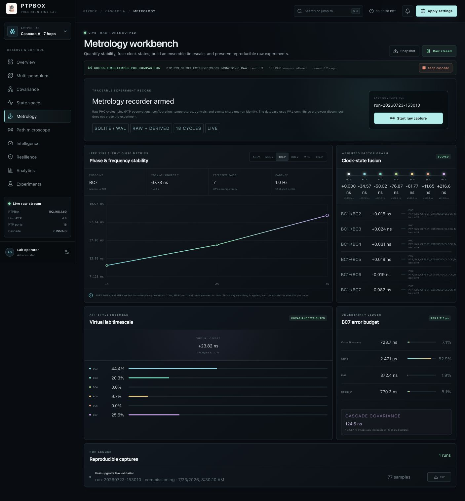

The metrology workbench renders two shared-scale clock-stability atlases from
the same raw endpoint phase record. ADEV, MDEV, HDEV, PDEV, TOTDEV, and Theo1
remain dimensionless fractional-frequency deviations; TDEV, MTIE, and TIE RMS
remain in nanoseconds. It reports the number of usable terms with every point,
uses Theo1's effective averaging time \(0.75m\tau_0\), and never fills missing
live samples or invents a pair-count confidence percentage. A weighted
least-squares factor graph fuses direct BC1 comparisons, adjacent-hop
constraints, and a common PPS edge when the hardware exposes one. The ensemble
clock uses covariance-regularized inverse weighting, while the error budget
separates cross-timestamp uncertainty, servo noise, observed path motion, and
holdover prediction. Cascade uncertainty is propagated through the measured
hop covariance instead of assuming that every stage is independent.

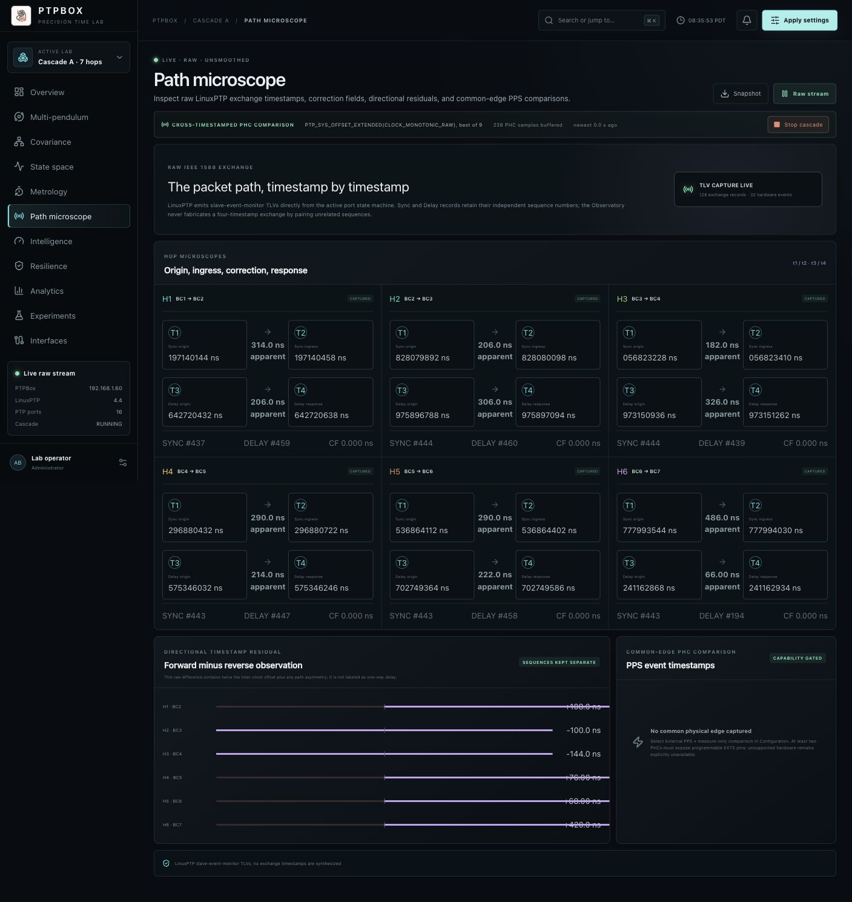

The path microscope records LinuxPTP slave-event-monitor TLVs for every
adjacent Sync/Follow_Up and Delay_Req/Delay_Resp exchange. `t1` through `t4`,
both sequence IDs, and correction fields are retained as decimal strings so
nanosecond precision is not lost to JSON floating point. The directional
timestamp residual is intentionally labeled **apparent**: without a common
external timebase, it contains twice the inter-clock phase offset as well as
path asymmetry. PTPBox does not mislabel that observable as calibrated one-way
delay.

## Observe the cascade as a dynamical system

The **Cascade Dynamics Observatory** brings clock, network, servo, and
oscillator evidence into one qualification-aware page:

- sliding ADEV/MDEV and first-difference FTU/ADEVS atlases expose stability
  regime changes instead of collapsing the complete run into one curve;
- Welch cross-spectral matrices show frequency-by-hop amplification,
  adjacent-hop coherence, phase, and dominant spatial modes, with
  multiresolution log-frequency coherent bands;
- servo-state transitions, dwell time, local pole estimates, Kalman
  NIS/innovation-whiteness checks, and ARX information eigenvalues reveal
  estimator health and identifiability;
- holdover reachability tubes estimate time-to-mask risk, while N-cornered
  clock decomposition remains gated until the clocks are genuinely independent
  in holdover;
- timing OAM separates constant time error, dynamic time error, peak-to-peak
  error, and measured hop accumulation;
- paired Sync/Delay observations classify round-trip congestion and directional
  imbalance without calling the result calibrated path asymmetry; and
- bicoherence, delay-embedding Betti curves, multiscale sample entropy, and
  lagged predictive dependence expose nonlinear structure without turning it
  into a chaos or causality claim.

The passive cascade map is intentionally not labeled formal string stability.
That claim requires an independent persistently exciting input. For a PTPBox
Kalman-family servo, the page can run a bounded random-phase multisine
frequency experiment with a hard peak correction, fixed duration, and
raw-offset abort limit. Instrumental cross spectra then publish plant and
open-loop estimates, \(S\), \(T\), \(KS\), Nyquist geometry, a coherence-gated
balanced disk margin, and a frequency-dependent plant-scatter/IQC-style
envelope. The same qualified bins now report empirical \(H_2\) and
\(H_\infty\) norms for \(\hat G\), \(S\), \(T\), and \(KS\), separating average
noise-energy gain from worst measured disturbance amplification.

> [!CAUTION]
> BC1-referenced adjacent-hop PHC differences telescope algebraically to the
> direct endpoint difference. PTPBox never presents that zero as a measured
> transfer-noise floor. FTU and ADEVS remain explicitly labeled **clock +
> transfer composite** until an independent loopback, common-edge, or
> calibrated residual is connected.

<table>
  <tr>
    <td width="50%">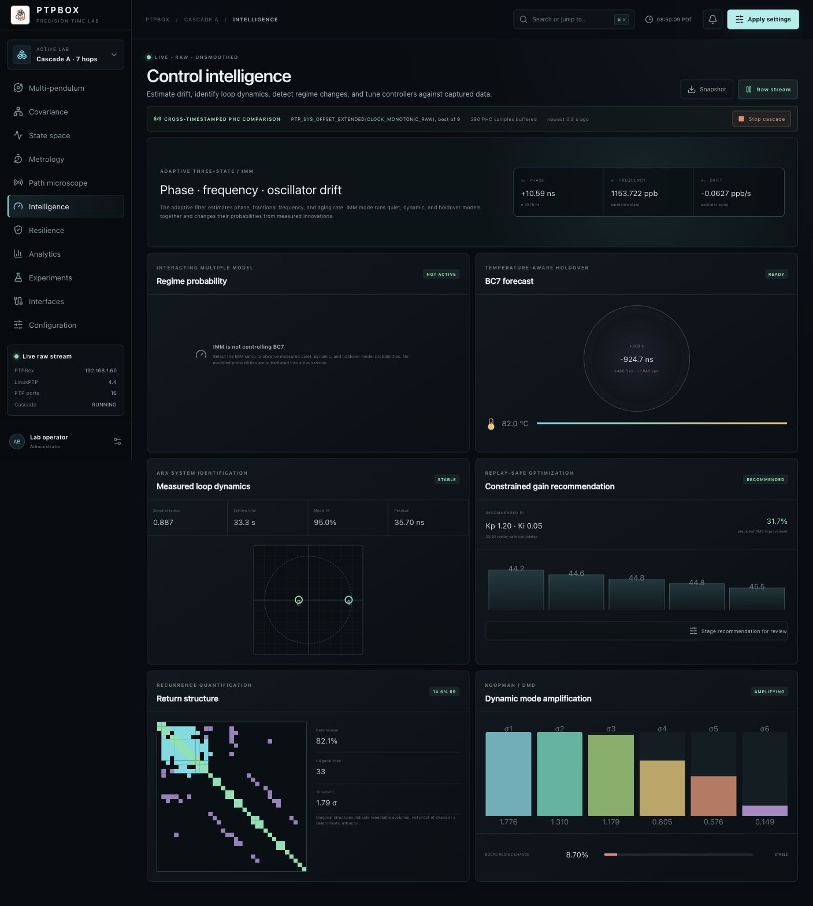</td>
    <td width="50%">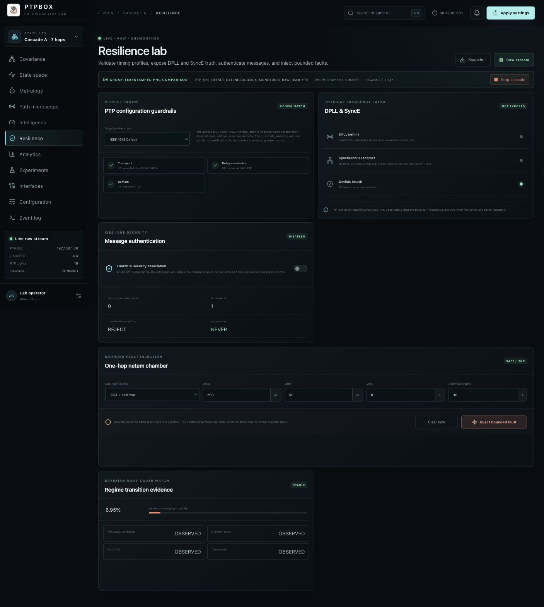</td>
  </tr>
  <tr>
    <td><strong>Control intelligence</strong><br>Three-state adaptive Kalman, interacting multiple models, temperature-aware holdover, ARX identification, replay-only Gaussian-process tuning, PI response bifurcation, recurrence quantification, fractal scaling, Koopman/DMD, and Bayesian online change detection.</td>
    <td><strong>Resilience lab</strong><br>Profile configuration guardrails, capability-gated DPLL/SyncE truth, LinuxPTP Authentication TLVs, and one-hop netem faults with mandatory automatic expiry.</td>
  </tr>
</table>

These panels are estimators and diagnostic instruments, not autonomous
decision makers. Gain optimization evaluates captured samples only and stages a
recommendation for operator review; it never explores gains on the live
cascade. Hardware claims remain capability-gated, and profile checks are
configuration guardrails rather than standards certification.

### Sweep response branches without touching a clock

The nonlinear workbench now moves directly between the recurrence plot and a
gain-parameter bifurcation map. For each multiplier from 0.25× to 2.50×, it
replays the captured endpoint PHC phase through the configured PI gains,
discards controller-state transients, and plots extrema from the settled tail.
The 1.00× configured PI baseline and the first replay safety-bound crossing are
marked on the same axes. When the endpoint is running another servo, such as
adaptive Kalman, the line says **PI baseline** instead of implying that PI is
live. The ledger keeps the active-controller provenance, base gains, settled
RMS, response-band count, and regime visible.

This is intentionally labeled a **replay bifurcation map** and reports
`live_changes: 0`. It is a screening instrument for fixed, multi-band, and
divergent response regions—not proof that the physical clock cascade underwent
a mathematical bifurcation. That stronger claim requires a controlled hardware
gain sweep with adequate dwell and settled observations at every step.

### Measure fractal scaling without inventing a chaos claim

The same nonlinear workbench includes a **Fractal analysis** view with three
complementary finite-record diagnostics:

- **Grassberger–Procaccia correlation dimension \(D_2\)** reconstructs delayed
  endpoint-phase states at embedding dimensions 2 through 5, excludes temporal
  neighbors with a Theiler window, highlights the selected log–log scaling
  interval, and reports whether the estimate actually converges as embedding
  dimension increases.
- **Higuchi graph dimension \(D_H\)** measures the roughness of endpoint phase
  versus sample index and publishes the regression \(R^2\), sample count, and
  maximum interval \(k\). It is deliberately labeled as trace dimension rather
  than attractor dimension.
- **MF-DFA** estimates generalized Hurst exponents from \(q=-4\) through \(q=4\)
  and reports the spectrum width \(\Delta h\). Six deterministic shuffled
  surrogates preserve the phase-value distribution while breaking temporal
  order, helping distinguish correlation-driven width from a broad marginal
  distribution.

Higuchi starts at 32 endpoint samples, correlation dimension at 64, and MF-DFA
at 128. Every value comes from raw captured endpoint PHC phase without
interpolation and reports `live_changes: 0`. A non-integer dimension, high fit
quality, or broad multifractal spectrum is **not by itself evidence of
deterministic chaos, exact self-similarity, or a strange attractor**.

## Watch every adapter's temperature in the topology

Each clock in the physical topology carries its adapter's die temperature behind
a thermometer whose colour is interpolated continuously across the range NIC
ASICs actually occupy, so a card creeping from 96 to 104 °C is visible while it
happens rather than only when it crosses a band edge. Readings come from the
capability probe on their own interval and are retained between polls, so a slow
or partial probe leaves the last known value in place instead of blanking a
sensor that was reading a moment ago.

On the reference host this immediately separates the fleet. Four adapters cluster
between 86 and 89 °C over a 30-minute window while two run hot, near 98 and
101 °C, and the hottest card is also the worst free-running oscillator in the
holdover trial. Sensors are attributed to their owning PCI device, because seven
identical adapters otherwise report seven identically named sensors.

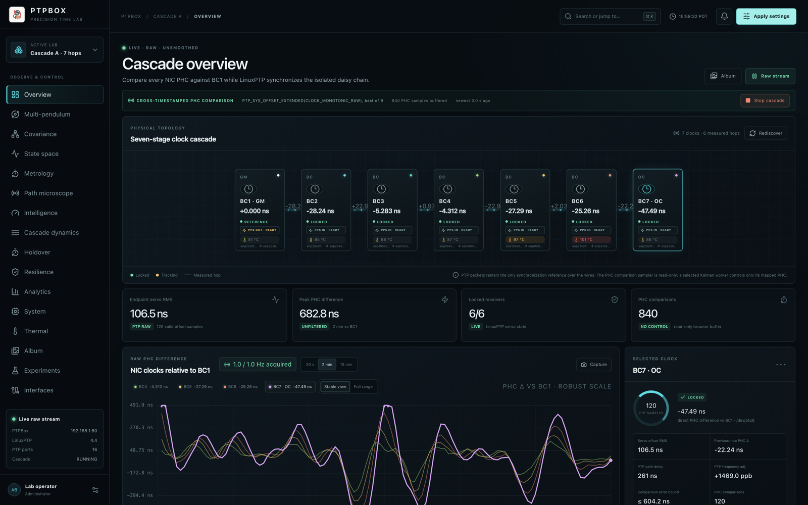

<sub>Live topology on the reference host. Each stage carries its adapter's die
temperature, and the thermometer grades continuously with the reading, so the two
hot cards separate from the 81 to 87 °C group at a glance.</sub>

## Map oscillator correction against temperature

The **Oscillator Thermal Response** page regresses each clock's applied
frequency correction on its die temperature. That measures a temperature
coefficient because the correction is the negation of the oscillator's own
frequency error. The scatter carries both the least-squares and the Deming fit
lines, so the attenuation caused by whole-degree readings is visible as the angle
between them, and sample age is encoded as opacity so a temperature that merely
tracks elapsed time appears as a gradient along the fit rather than an
undifferentiated cloud. A residual-against-temperature plot sits beneath it,
because with three to five quantised levels a cubic can win on AIC without any
resolvable curvature.

Three properties of passive data drive the design. Whole-degree sensors put
about 0.29 °C of noise into the regressor and attenuate least squares toward
zero, so a Deming errors-in-variables slope is reported beside it. Temperature is
collinear with elapsed time, so a temperature-only fit absorbs oscillator
ageing; a joint fit separates them. Consecutive samples are serially correlated,
so standard errors are scaled by an effective sample size rather than a raw
count.

Seven evidence gates then decide whether a coefficient may be claimed at all,
covering span, distinct levels, time collinearity, residual independence,
effective samples, and slope significance. Passive operation cannot pass them:
on the reference host every clock reports *candidate* or weaker across a two to
four degree span, and the joint fit shows a coefficient falling from 251 to
131 ppb/°C once a 0.61 ppb/s ageing term is separated out. Earning a defensible
coefficient requires deliberate thermal forcing, and the page says so instead of
publishing a number it cannot support.

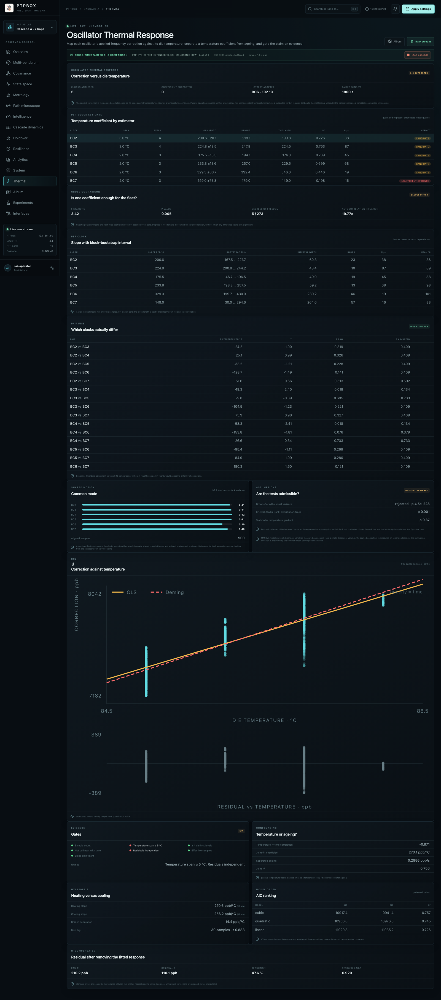

<sub>Live Oscillator Thermal Response. Every clock reports <em>candidate</em> or
weaker, three estimators are shown side by side so quantisation attenuation is
visible, and the fleet test reports that one coefficient does not describe every
card.</sub>

### Compare the oscillators against one another

The cross-comparison asks the question worth asking. Whether the cards have
different mean corrections is not interesting: they are different oscillators
with different offsets. Whether their *slopes* differ is, so the page tests
homogeneity of regression slopes on per-clock centred data, with degrees of
freedom discounted by the measured autocorrelation inflation, which is about
sixteen on the reference host and without which every pair would look
significant.

Alongside it: block-bootstrap slope intervals that resample contiguous blocks
sized from each clock's own residual autocorrelation, pairwise differences with
a Benjamini–Hochberg adjustment across the whole family, Brown–Forsythe and
Kruskal–Wallis checks on the assumptions the F test rests on, and a common-mode
eigen-decomposition. That last one carries the result: 84 % of the cross-clock
frequency variance is shared, with near-equal loadings on every card, which is
why they all show a similar apparent slope. They are responding to one shared
influence, not exhibiting six independent coefficients.

MANOVA is recorded as inapplicable rather than added. It models several dependent
variables measured on one unit, whereas here a single dependent variable is
measured on separate clocks; the multivariate question is answered by the
common-mode decomposition instead.

### Score temperature-compensated holdover before arming it

During holdover the PHC free-runs and accumulates phase at the oscillator's own
frequency error. If that error tracks temperature, continuing to apply a
temperature-driven correction should cancel part of the drift. Whether it
actually would is empirical, so the option is scored against a recorded free run
rather than assumed.

Two coefficients are evaluated: the one measured while locked, which a
compensator could really use, and the best obtainable in hindsight, which bounds
what compensation could ever achieve on that record. When the second is small the
drift is not temperature-driven and no coefficient will help. Arming is refused
unless the coefficient's own evidence verdict is supported, and on the reference
host that gate earns its place: the measured coefficient would have worsened five
of six clocks, one of them by 178 %.

## Steer holdover with temperature, if a model earns it

Scoring says whether compensation *could* help. The **compensated holdover
controller** is the thing that would actually do it. While a stage is locked, the
correction its servo applies is the negated oscillator error, so the locked window
is a labelled training set: what correction this oscillator needed at a given die
temperature and a given age. Four candidates are fitted on it, and after release a
timer-driven worker applies the winner through `clock_adjtime`. Holdover removes
the offsets every other servo reacts to, which is why this one is driven by a
clock rather than by samples.

| Candidate | What it assumes |
|---|---|
| `frozen` | Hold the last correction. The baseline everything must beat. |
| `drift` | Frequency ages linearly with time. |
| `temperature` | Frequency follows die temperature. |
| `temperature-drift` | Both, fitted jointly because they are collinear here. |

Candidates are ranked by forecasting stretches of the locked window they never
saw, never by fit. One held-out split turned out not to be enough: the winner
changes with where the split falls. On BC6 a split at 25 % reports a 51 % gain for
a temperature model while splits either side of it refuse outright. Selection
therefore runs over five rolling origins, and a model is armed only if its median
gain reaches 15 % **and** it wins 80 % of folds.

Under that rule the reference host is unanimous, across two windows and every fold
count: every clock refuses. The best candidates reach +19 % to +30 % but win only
three folds of five, and several median gains are negative. Compensation here
would be worse than freezing, so the controller stays out of the way and says why.

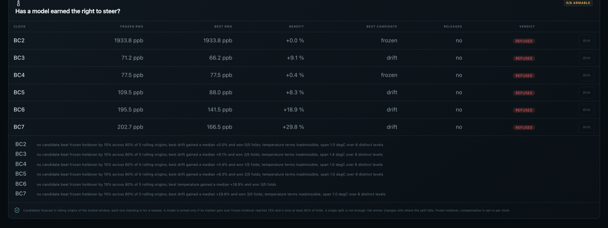

<sub>Live controller verdict. Every clock is refused, each with the fold count it
actually won and the reason, so the operator can see what evidence would be
needed rather than a bare failure.</sub>

What reaches a clock is bounded regardless: correction magnitude and slew rate are
capped, the ageing ramp stops extrapolating past its fitted horizon, temperature is
clamped near the observed range, and the first tick after release keeps exactly what
the servo left behind so arming cannot step the oscillator. Arming needs the clock
already released, and the agent refuses a model that failed validation, so the
verdict cannot be overridden from the HTTP surface.

## Does a servo want temperature too?

The short answer for a well-fed servo is no, and the measurement says why. At the
4 Hz Sync rate the phase change temperature predicts over one interval is 0.06 to
0.09 ns, against 52 to 145 ns of offset noise: three to four orders of magnitude
below what the loop already rejects. The three-state filter also carries drift as
a state and estimates it directly from phase, so temperature would be an indirect,
whole-degree proxy for something already observed better. None of the six servos
(`pi`, `linreg`, `nullf`, `kalman`, `adaptive-kalman`, `imm`) reads temperature.

Sparsity is what changes the balance, so the option exists for that case. The
thermal term is not a tuned gain; it is a second observation of drift, fused by
inverse variance against the filter's own drift covariance:

```
d_fused = (d_kf/s_kf^2 + d_th/s_th^2) / (1/s_kf^2 + 1/s_th^2)
```

The weight is derived, never configured. A sharp drift estimate drives the thermal
contribution to nothing on its own, which is what makes it safe to leave enabled at
a high packet rate, and the sensor keeps its own polling cadence so its slope stays
sharp as the Sync rate thins.

`scripts/replay_thermal_servo.py` scores it against the temperature-blind filter on
recorded data, emulating sparse Sync by decimating a real record. It is an estimator
comparison, not a closed-loop one: a recording was produced under the servo that was
running, so only forecast quality can be compared honestly.

| Update interval | Drift estimate | Phase forecast |
|---|---|---|
| 1 s | −4.6 % | −0.01 % |
| 9 s | −5.3 % | −0.03 % |
| 16 s | −5.3 % | +0.5 % |
| 32 s | — | **+17.8 %** |
| 64 s | — | **+160.8 %** |

The drift state genuinely improves, and the gain is real rather than an artifact of
blending: sign-flipping the coefficient makes it *worse* by 7.6 %, and halving it
gives half the benefit, which shrinkage cannot produce. But the improvement never
reaches phase, and past a 16 s interval the feedforward becomes actively harmful,
because drift extrapolates as `½·d·T²` and that square amplifies any bias in the
coefficient. The sparse regime the feature was built for is exactly where an
unsupported coefficient does the most damage.

So the feedforward requires a coefficient whose evidence verdict is `supported`,
and on this host all six are `candidate`. It is present, wired, and inert, and the
servo says so instead of quietly running blind. Earning a supported coefficient
needs deliberate thermal forcing, which is the prerequisite for this and for
compensated holdover alike.

## Inspect the host itself

The **System Observatory** reports host identity and uptime, processor model with
delta-sampled utilisation and load, memory and swap, real filesystem capacity,
thermal sensors sorted hottest first, and a PCI inventory grouped by driver.
Everything is read from `/proc`, `/sys`, and mount statistics, so it needs no
privilege and cannot reach a clock.

It also verifies the declared cascade against observed link state, hop by hop,
and reports host addressing, routing, and resolver state read-only. Neither is
overstated: link checking is not physical peer discovery, which needs the
raw-frame prober and a torn-down cascade, and the network view reports
`editable: false` because the interface carrying the default route is also the
one serving the API. Cascade timing ports are absent from that list by design,
since the controller moves them into per-stage namespaces, and the panel counts
declared against locally visible ports rather than letting their absence read as
missing hardware.

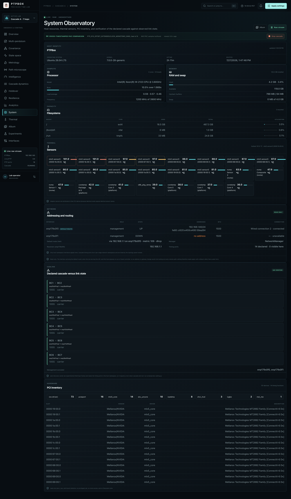

<sub>Live System Observatory. Sensors are attributed per PCI device and coloured by
severity, all six declared cascade links verify against observed carrier and speed,
and the network panel is explicitly read-only.</sub>

## What you can do

| Surface | Purpose |
| --- | --- |
| **Cascade overview** | See the physically verified topology, direct PHC differences, per-hop deltas, path delay, frequency correction, and servo state. |
| **Multi-pendulum** | Turn every previous-hop PHC residual into a connected rod angle, with robust equilibrium learning, regime-shift auto-zeroing, and a per-hop swing ledger. |
| **Covariance lab** | Compare synchronized phase-change rates as covariance or correlation, follow every pair through time, and inspect eigenvalues plus dominant-mode loadings. |
| **Attractor Observatory** | Reconstruct endpoint dynamics with Takens coordinates, choose lag with AMI, check embedding with false nearest neighbors, locate recurrent-core candidates, inspect return/Poincaré maps, estimate local divergence, gate on regime stationarity, and require corroborating evidence before showing a candidate-attractor label. |
| **Metrology** | Compare ADEV, MDEV, HDEV, PDEV, TOTDEV, and Theo1 on a shared fractional-frequency scale; compare TDEV, MTIE, and TIE RMS on a shared time-error scale; inspect drift and local noise-slope candidates; fuse redundant offset constraints; build an ensemble clock; and propagate a covariance-aware error budget. |
| **Path microscope** | Inspect preserved `t1`/`t2`/`t3`/`t4` exchange timestamps, correction fields, independent sequence IDs, and scientifically qualified directional residuals. |
| **Control intelligence** | Estimate phase/frequency/drift, switch among quiet/dynamic/holdover models, predict thermal holdover, identify loop dynamics, detect changes, rank replay-safe PI gains, inspect settled response branches, and compare correlation, Higuchi, and multifractal scaling. |
| **Cascade Dynamics Observatory** | Follow dynamic stability, coherent spatial modes, passive hop amplification, estimator consistency, identifiability, timing OAM, holdover reachability, nonlinear structure, and evidence-gated active loop identification from one surface. |
| **Oscillator thermal response** | Regress applied correction on die temperature with least-squares, Deming errors-in-variables, and Theil–Sen estimators; separate coefficient from ageing; rank polynomial order by AIC; split heating and cooling branches; and gate the claim on seven independent conditions. |
| **Thermal cross comparison** | Test homogeneity of regression slopes with autocorrelation-discounted degrees of freedom, bootstrap each slope by contiguous blocks, adjust pairwise comparisons for false discovery, check equal variance and rank distribution, and decompose chassis-common from card-specific motion. |
| **Compensated holdover scoring** | Score what temperature-compensated holdover would have achieved against a recorded free run, against both the measured and the best-possible coefficient, and refuse to arm on an unsupported coefficient. |
| **System Observatory** | Read host identity, processor utilisation and load, memory, filesystem capacity, thermal sensors attributed to their PCI device, and PCI inventory; verify the declared cascade against link state; and read addressing, routing, and resolvers without any privileged call. |
| **Topology thermometers** | See each adapter's die temperature in the physical topology, tinted continuously across the range the hardware occupies. |
| **Holdover chamber** | Qualify continuous lock, capture a per-node release baseline, stop adjustment without stopping observation, plot raw wander, report rate error, and restore the exact saved servos. |
| **Resilience lab** | Validate profile preset fields, expose kernel DPLL/SyncE state without inference, configure message authentication, and inject automatically expiring one-hop faults. |
| **Analytics** | Compare unsmoothed read-only PHC measurements, inspect the endpoint distribution, and export raw timestamped samples. |
| **Durable experiments** | Capture configuration and raw PHC samples in a SQLite/WAL run ledger, stop without losing data, and export an immutable CSV by run ID. |
| **Servo & holdover control** | Select native PI/linear-regression/null-frequency discipline, classic Kalman, adaptive phase/frequency/drift Kalman, or quiet/dynamic/holdover IMM per clock; change discipline while read-only monitoring stays live. |
| **Thermal servo feedforward** | Fuse a die-temperature drift observation into the three-state or IMM servo by inverse variance, so a sharp drift estimate gives it no weight and a sparse one gives it more; requires a `supported` coefficient, and refuses aloud otherwise. |
| **Compensated holdover** | Fit frozen, ageing, temperature, and joint models on the locked window, rank them by forecasting rolling origins, and arm one only if it beats frozen holdover by 15 % across 80 % of folds; bounded in magnitude, slew rate, and extrapolation horizon, and off by default. |
| **PPS & `ts2phc` control** | Select a PHC or external PPS source, configure pins and `ts2phc`, or compare two or more PHCs against one physical PPS edge in strictly measurement-only mode. |
| **Lifecycle control** | Start or stop the real namespace cascade from the UI after the guarded host helper is installed. |
| **Hardware inventory** | Discover NICs, PCI addresses, drivers, link rates, PHCs, and hardware timestamping capability. |
| **Notifications & event stream** | Follow measurement health, lock state, active servo mix, threshold events, and operator actions. |
| **Command palette** | Press <kbd>⌘ K</kbd> or <kbd>Ctrl K</kbd> to search every observatory page, clock, measurement surface, and live control, then open it without leaving the keyboard. |
| **Graph album** | Capture any graph as an evidence-rich PNG, review host-shared and browser-local images together, open a full-size preview, download, or delete. |
| **Demo mode** | Use an explicitly labeled deterministic fallback only when the live agent is unavailable. |

## Product tour

<table>
  <tr>
    <td width="50%">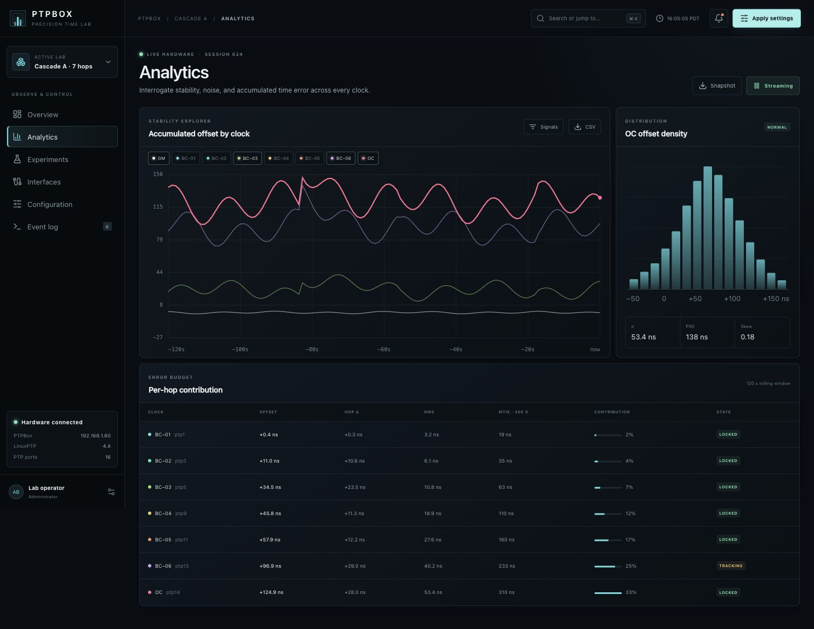</td>
    <td width="50%">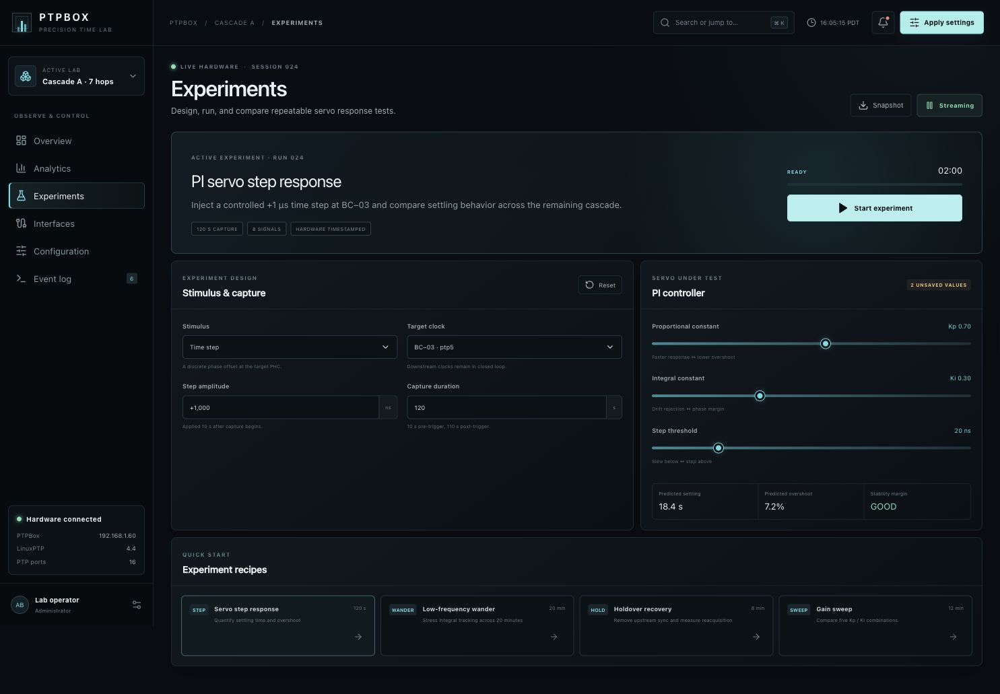</td>
  </tr>
  <tr>
    <td><strong>Stability analytics</strong><br>Raw trace selection, endpoint density, window RMS, frequency correction, and CSV export.</td>
    <td><strong>Repeatable experiments</strong><br>Step response, holdover, wander, and gain-sweep recipes.</td>
  </tr>
</table>

<table>
  <tr>
    <td width="50%">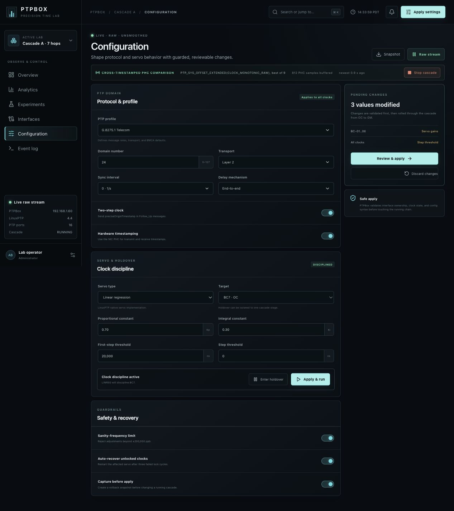</td>
    <td width="50%">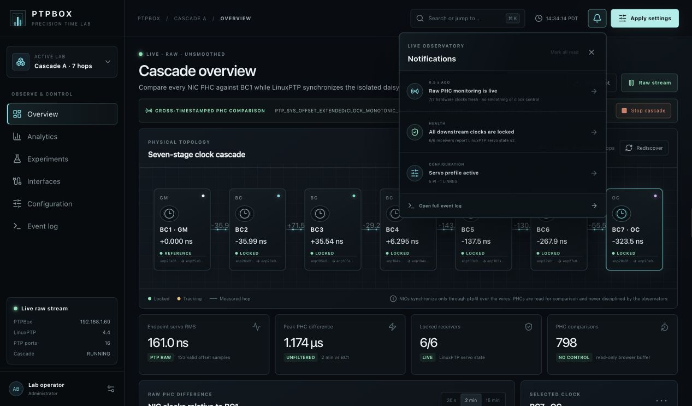</td>
  </tr>
  <tr>
    <td><strong>Servo and holdover control</strong><br>Choose PI, linear regression, null frequency, classic Kalman, adaptive phase/frequency/drift Kalman, or IMM for one stage or the downstream chain. Enter holdover while raw monitoring continues.</td>
    <td><strong>Live notification center</strong><br>See PHC freshness, receiver lock health, and the active servo mix, then jump directly to the relevant control-room surface.</td>
  </tr>
</table>

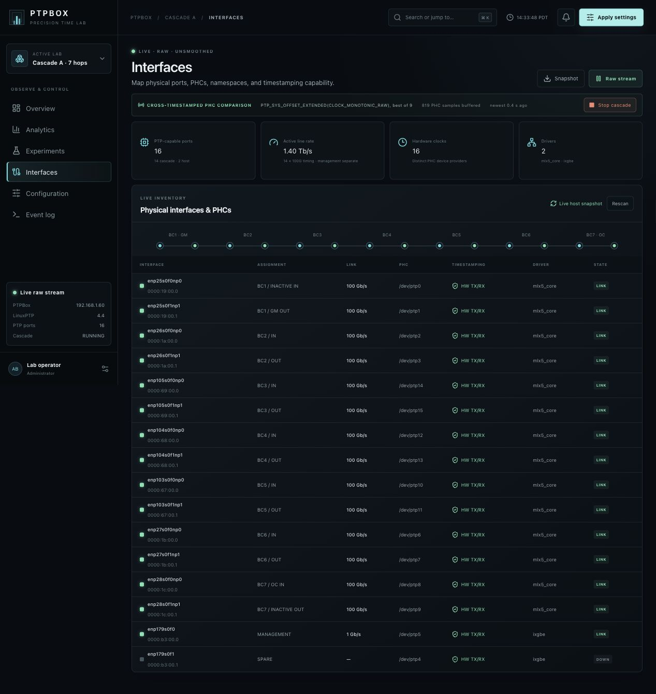

The inventory above is read from the host: sixteen PTP-capable ports, fourteen
active 100G timing links, PHC device providers, PCI functions, drivers, and
hardware timestamp capability.

## Two ways to run it

### 1. Observer / demo mode — no root required

This serves the complete UI, discovers the host, reads LinuxPTP logs, and stages
configuration without moving interfaces or starting privileged processes.

```bash
git clone https://github.com/ahmadexp/PTPBox.git
cd PTPBox
npm ci
npm run build:standalone

PTPBOX_ROOT="$PWD" \
PTPBOX_WEB_ROOT="$PWD/dist-standalone" \
python3 agent/ptpbox_agent.py
```

Open [http://localhost:8090](http://localhost:8090). If the agent cannot find
live measurements, the Observatory labels itself as a hardware model and keeps
every visualization interactive.

### 2. Full host integration — physical cascade

```bash
# 1. Map this machine's PTP ports and protect its management links.
$EDITOR agent/topology.json

# 2. Build, install, and start the persistent web agent.
npm ci
npm run build:standalone
sudo PTPBOX_USER="$(id -un)" PTPBOX_ROOT="$PWD" bash scripts/install-host.sh

# 3. Validate before moving any NIC.
sudo ptpboxctl discover
sudo ptpboxctl status

# 4. Start from the CLI, or use Start cascade in the Observatory.
sudo ptpboxctl start
```

The UI is then available at `http://<ptpbox-host>:8090`. See the complete
[installation and upgrade guide](docs/INSTALLATION.md) before starting the data
plane.

## Architecture

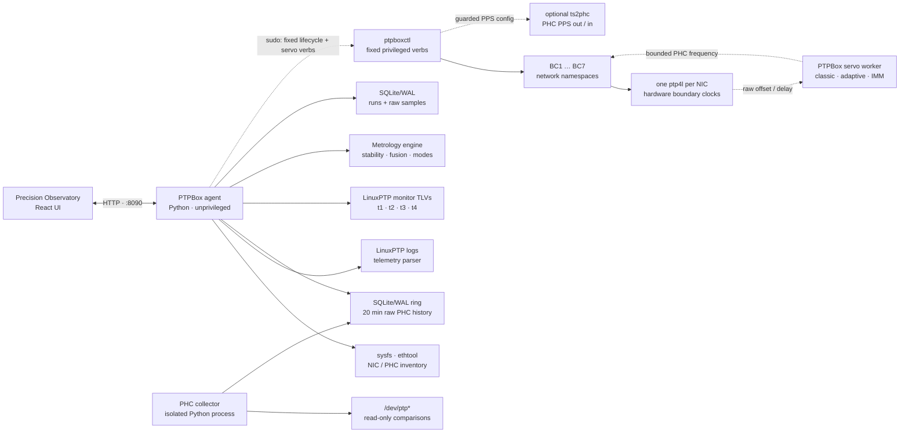
```mermaid
flowchart LR
    Browser["Precision Observatory\nReact UI"]
    Agent["PTPBox agent\nPython · unprivileged"]
    Collector["PHC collector\nisolated Python process"]
    Inventory["sysfs · ethtool\nNIC / PHC inventory"]
    Logs["LinuxPTP logs\ntelemetry parser"]
    PHCs["/dev/ptp*\nread-only comparisons"]
    RawStore["SQLite/WAL ring\n20 min raw PHC history"]
    Helper["ptpboxctl\nfixed privileged verbs"]
    Research["Metrology engine\nstability · fusion · modes"]
    Store["SQLite/WAL\nruns + raw samples"]
    Events["LinuxPTP monitor TLVs\nt1 · t2 · t3 · t4"]
    Kalman["PTPBox servo worker\nclassic · adaptive · IMM"]
    NS["BC1 … BC7\nnetwork namespaces"]
    PTP["one ptp4l per NIC\nhardware boundary clocks"]

    Browser <-->|"HTTP · :8090"| Agent
    Agent --> Inventory
    Agent --> Logs
    Collector --> PHCs
    Collector --> RawStore
    Agent --> RawStore
    Agent --> Events
    Agent --> Research
    Agent --> Store
    Agent -. "sudo: fixed lifecycle + servo verbs" .-> Helper
    Helper --> NS
    NS --> PTP
    PTP -. "raw offset / delay" .-> Kalman
    Kalman -. "bounded PHC frequency" .-> NS
    Helper -. "guarded PPS config" .-> PPS["optional ts2phc\nPHC PPS out / in"]
```

The agent runs as the operator, not root. Observation stays unprivileged.
Lifecycle, servo, and bounded-fault control cross a narrow sudo boundary that
accepts six fixed operations and no arbitrary command line. See
[Architecture](docs/ARCHITECTURE.md) and [Security](SECURITY.md).

The Configuration page also exposes a safe-off-by-default PPS lab: select a PHC
source or external PPS, choose PPS input clocks, pins, edge, pulse width, phase,
correction, and the `ts2phc` servo. Apply validates the real periodic-output and
external-timestamp capabilities before a managed process is started. The
Overview reports each clock's actual PPS role, connector function, and runtime
state from sysfs and the managed process table.

## What gets measured

- Common-epoch PHC difference for each NIC relative to BC1, using the best of
  nine kernel cross timestamps and an interpolated BC1 reference, sampled at
  the applied 0.5–8 Hz protocol-valid Sync cadence by a dedicated collector
  process that cannot be starved by nonlinear research calculations
- Raw LinuxPTP servo-offset RMS in nanoseconds, separate from PHC comparison
  dispersion and its reported error bound
- Overlapping ADEV, MDEV, HDEV, PDEV, TOTDEV, and Theo1 fractional-frequency
  stability plus TDEV, MTIE, and TIE RMS time-error stability across supported
  averaging intervals, including usable-term counts, detrended phase RMS,
  frequency bias/drift, and explicitly qualified local MDEV noise-slope
  candidates
- Read-only previous-hop delta and cumulative cascade error
- LinuxPTP master offset, mean path delay, and frequency adjustment
- Preserved `t1`/`t2`/`t3`/`t4` timestamp-exchange records and qualified
  apparent directional residuals
- Classic and adaptive Kalman phase/frequency/drift estimates,
  covariance-derived uncertainty, innovation acceptance, rejected-sample
  count, and applied bounded correction
- IMM quiet/dynamic/holdover probabilities and the active regime
- Temperature-aware holdover prediction with uncertainty
- ARX actuation-to-phase model with poles, fit, residual, settling estimate,
  measured Bode magnitude/phase, Nyquist geometry, direct Jury/Schur digital
  stability, and a bilinear-equivalent Routh–Hurwitz array
- Replay-only PI autotuning with global/log-local Bayesian optimization,
  ARX stability penalties, optional \(H_\infty\) sensitivity penalties, an
  evaluated safe frontier, and zero live exploratory changes
- Lock/tracking state and recovery events
- Holdover qualification progress, per-node release baselines, elapsed
  free-run time, current/peak/RMS wander, and frequency drift from the
  continuing raw PHC trace
- Offset distribution, P95, skew, and contribution share
- Weighted factor-graph residuals, covariance-regularized ensemble weights,
  and correlated-versus-independent cascade uncertainty
- Rolling phase-change covariance/correlation, full pair timelines, eigenvalues,
  explained trace, effective rank, and dominant eigenvector loadings
- Delay-coordinate endpoint reconstruction, AMI lag selection, false-nearest-
  neighbor curves, recurrent-core occupancy, successive-maxima return maps,
  finite-record local divergence, empirical Poincaré crossings, modal
  coordinates, and rolling eigenvalue shares
- Recurrence rate/determinism, Koopman/DMD amplification, and Bayesian online
  change probability
- Per-adapter die temperature, attributed to its owning PCI device
- Oscillator temperature coefficient by least-squares, Deming, and Theil–Sen
  estimators, with ageing separated by a joint temperature/time fit, polynomial
  order ranked by AIC, hysteresis branches, thermal lag, and seven evidence gates
- Between-clock slope homogeneity, block-bootstrap slope intervals,
  false-discovery-adjusted pairwise differences, equal-variance and rank tests,
  and the chassis-common share of cross-clock frequency motion
- Modelled benefit of temperature-compensated holdover against both the measured
  and the best-possible coefficient
- Host processor, memory, filesystem, thermal, and PCI inventory, plus addressing,
  routing, and resolver state, all read-only
- NIC carrier, speed, driver, PCI bus, PHC, and timestamp capability
- Per-node PPS availability, configured in/out role, live PHC pin function,
  channel, connector, and managed `ts2phc` state
- Experiment metadata, servo constants, and capture lifecycle

The live agent reads mapped PHCs without changing them and separately parses
native LinuxPTP output. Missing data is never silently presented as live; the
UI switches to its deterministic hardware-model mode.

## What “raw” means

When the Observatory says **LIVE · RAW · UNSMOOTHED**, the plotted points come
from the installed machine. Each PHC comparison uses Linux
`PTP_SYS_OFFSET_EXTENDED` cross timestamps and selects the lowest-error reading
from a nine-sample measurement burst. That improves the error bound of one
measurement; it does not average or smooth the time series.

Servo RMS is calculated separately from native LinuxPTP master-offset samples
reported by `ptp4l`. The UI never substitutes PHC-comparison dispersion for
servo RMS. During holdover, observation continues while only the selected clock
discipline is disabled, so drift remains measurable. If either raw source is
missing or stale, the interface says so instead of manufacturing a live value.

The path microscope is raw in a different sense: it preserves the exchange
timestamps exported by LinuxPTP's event monitor. Its apparent forward/reverse
residual is not a one-way path calibration because the two PHCs are not already
on a common timebase. A shared external PPS edge can provide an independent
multi-PHC comparison when the NICs expose external-timestamp pins, but it also
remains read-only.

## Hardware

The current reference host uses seven dual-port ConnectX-6 Dx adapters with all
fourteen timing links at 100G, plus a separate Intel X550 management adapter.
Each timing adapter is isolated in its own namespace.
PTPBox never hides a split-clock card with a local synchronization loop: if its
ports do not share or hardware-synchronize a PHC, the direct comparison exposes
that difference as part of the experiment.

ConnectX cards must have device-wide real-time clock mode enabled and loaded by
a supported firmware reset. The [hardware guide](docs/HARDWARE.md) includes the
verified setting, reset sequence, current PCI/PHC map, and cable-probe workflow.

<table>
  <tr>
    <td width="48%">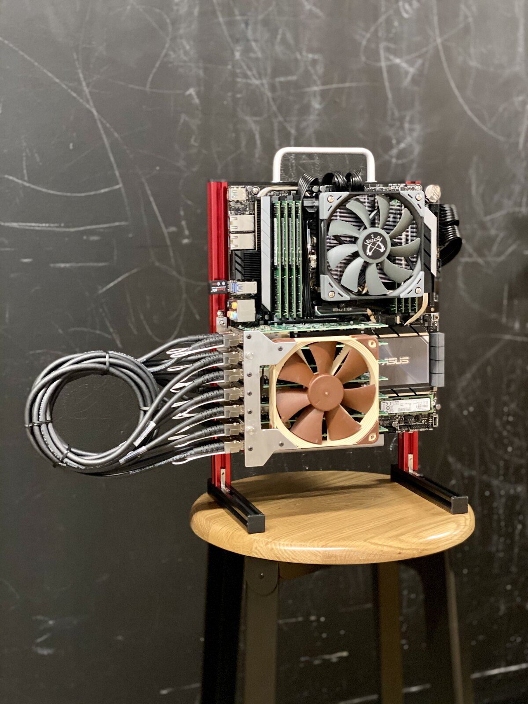</td>
    <td width="52%">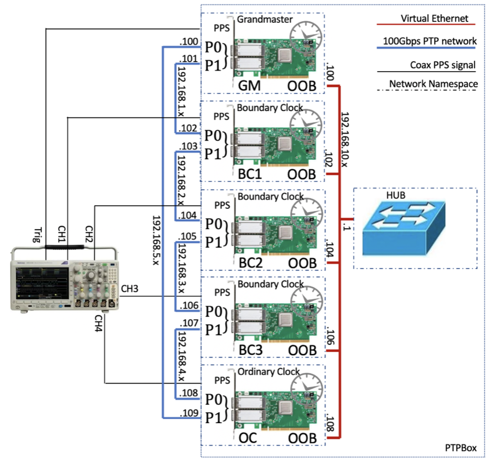</td>
  </tr>
  <tr>
    <td><strong>The original seven-NIC PTPBox host</strong></td>
    <td><strong>The original namespace cascade concept</strong></td>
  </tr>
</table>

Read the [hardware and topology guide](docs/HARDWARE.md) for discovery commands,
shared-PHC behavior, interface mapping, and a preflight checklist.

## Repository map

```text
app/                 Precision Observatory UI
agent/               Read-only host API, thermal and system analysis, topology, systemd units
scripts/             Safe lifecycle, install, and uninstall helpers
standalone/          Static-host entrypoint for the on-box agent
docs/                Installation, research, architecture, API, hardware, experiments
tests/               Rendered-product checks
.github/workflows/   CI for UI, Python, shell, and standalone builds
```

## Development

```bash
npm ci
npm run dev          # local application server
make check           # lint, tests, both builds, Python and shell validation
```

The main application uses React 19, TypeScript, Vinext/Vite, and Canvas-based
telemetry charts. The host agent uses only the Python standard library.

## Project status

The complete Precision Observatory is running on the seven-NIC reference host:
the ordered namespace cascade, common-epoch PHC comparison, raw LinuxPTP
telemetry, selectable native/Kalman/adaptive/IMM servos, measured holdover,
packet-path capture, stability metrology, factor fusion, ensemble time,
covariance-aware error budgets, nonlinear-dynamics diagnostics, guarded
profiles/security/faults, PPS common-edge comparison, and durable experiment
storage are implemented. Hardware-dependent instruments say **not exposed**
instead of inferring state when the driver or kernel lacks the required API.
See [CHANGELOG.md](CHANGELOG.md).

## Research foundations

The implementations are dependency-free and intentionally compact so they can
run on the appliance, but their definitions and operational boundaries follow
primary references:

- [NIST SP 1065, *Handbook of Frequency Stability Analysis*](https://www.nist.gov/publications/handbook-frequency-stability-analysis)
  for Allan-family, time-deviation, MTIE, and Theo statistics;
- [IEEE 1139-2022](https://standards.ieee.org/ieee/1139/7585/)
  for frequency-and-time metrology terminology, and the primary
  [PVAR paper](https://members.femto-st.fr/sites/femto-st.fr.michel-lenczner/files/content/papers/VerLen2015-2.pdf)
  for parabolic deviation;
- [Linux kernel PTP hardware clock infrastructure](https://docs.kernel.org/driver-api/ptp.html)
  for PHC clocks, cross timestamps, EXTS, and periodic outputs;
- [Linux kernel DPLL subsystem](https://docs.kernel.org/driver-api/dpll.html)
  for capability-gated physical-frequency state;
- [LinuxPTP servo configuration](https://www.linuxptp.org/documentation/default/)
  and [`ts2phc`](https://www.linuxptp.org/documentation/ts2phc/) for native
  servos, PPS, and Authentication TLVs;
- [NIST, *Steering a Time Scale*](https://www.nist.gov/publications/steering-time-scale)
  for weighted ensemble-clock design;
- [Adams and MacKay, *Bayesian Online Changepoint Detection*](https://arxiv.org/abs/0710.3742)
  for causal regime-change probability;
- [Schmid, *Dynamic Mode Decomposition of Numerical and Experimental Data*](https://doi.org/10.1017/S0022112010001217)
  for the snapshot-based dynamics operator;
- [Snoek, Larochelle, and Adams, *Practical Bayesian Optimization*](https://papers.nips.cc/paper_files/paper/2012/hash/05311655a15b75fab86956663e1819cd-Abstract.html)
  for Gaussian-process expected-improvement search.

See [Architecture](docs/ARCHITECTURE.md) for the exact implementation and
interpretation limits.

## Heritage

This project modernizes the public
[Time Appliances Project PTPBox prototype](https://github.com/Time-Appliances-Project/Incubation-Projects/tree/master/Software/PTPBox),
created by Ahmad Byagowi. The namespace architecture, seven-node cascade, and
hardware photographs come from that work.

## Contributing

Bug reports, hardware profiles, measurement ideas, and UI improvements are
welcome. Start with [CONTRIBUTING.md](CONTRIBUTING.md) and keep hardware safety
front and center. Contributions grant Ahmad Byagowi the right to incorporate
and commercially license the submitted work as part of PTPBox; see the
contribution terms before submitting.

## License

PTPBox is source-available under the
[PTPBox Noncommercial Source License 1.0](LICENSE).

You may use, study, modify, and redistribute PTPBox for noncommercial purposes,
subject to the license terms. **Any commercial use requires prior, express
written approval from Ahmad Byagowi.** The author reserves all commercial
rights exclusively; an approved third-party use is only a limited exception
within the scope of its written agreement.

© 2026 Ahmad Byagowi. All rights reserved except as stated in the license.
