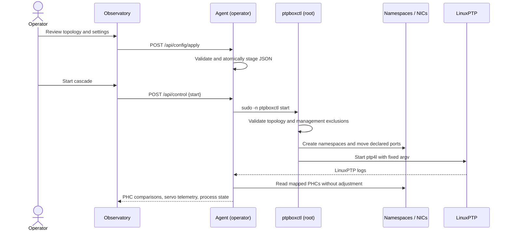

# Architecture

PTPBox separates product UI, unprivileged observation, and privileged data-plane
control. That separation keeps the common workflow safe while preserving the
ability to run a real multi-namespace PTP cascade.

## Components

### Precision Observatory

The React application in `app/` is a client-side instrument UI. It renders:

- the cascade and selected-clock detail;
- live or modeled offset traces on Canvas;
- stability and per-hop error analysis;
- experiment design and PI-servo tuning;
- interface/PHC inventory;
- guarded configuration review;
- event and session summaries.

It probes `http://<browser-host>:8090/api/status`. A query-string override is
available for development: `?agent=http://192.0.2.10:8090`.

The same component has two build targets:

- Vinext/Cloudflare output for the hosted demo;
- a Vite static bundle for the on-box Python agent.

### Host agent

`agent/ptpbox_agent.py` uses only the Python standard library. It runs as the
operator account and reads:

- `/sys/class/net` for link, driver, bus, MAC, speed, and PHC data;
- `ethtool -T` when sysfs does not expose a distinct PHC;
- `ip netns list` for namespace state;
- `ps` for active `ptp4l` processes;
- `/run/ptpbox/phcs.json` for the controller-verified NIC-to-PHC map;
- mapped `/dev/ptp*` clocks for one-hertz, read-only midpoint comparisons;
- raw LinuxPTP client logs in `/var/log/ptpbox`, with a legacy fallback below
  `PTPBOX_ROOT/BC*`, for offset, frequency adjustment, path delay, and servo
  state.

It also serves the standalone application and stages JSON configuration under
`PTPBOX_STATE_DIR`.

The browser requests an initial raw window and then polls incrementally with a
`since` cursor. Direct PHC comparisons and LinuxPTP diagnostics retain their
native timestamps. Missing samples are rendered as gaps; no moving average,
interpolation, or synthetic fill is applied in live mode.

### Lifecycle helper

`scripts/ptpboxctl.py` owns the privileged operations:

- validate interface and management-interface assignments;
- create/delete network namespaces;
- move/restore interfaces;
- start/stop LinuxPTP processes;
- generate role-specific `ptp4l` configuration;
- run one two-port boundary-clock process for every intermediate NIC;
- write the authoritative PHC measurement map for the unprivileged agent;
- never run a local PHC discipline loop—the NICs synchronize only through
  `ptp4l` over the physical chain;
- track child processes and logs.

Every daemon receives a unique management socket below `/run/ptpbox`; network
namespaces do not isolate Unix-domain socket paths. On AppArmor-enabled Ubuntu
hosts, the installer adds a local profile include for those sockets, inherited
PTPBox logs, and the multi-PHC JBOD clock-switch notification path.

The reference host uses end-to-end delay, as did the original PTPBox. The
generated LinuxPTP configuration matches `summary_interval` to the Sync
interval. LinuxPTP therefore emits one signed master-offset sample per update
instead of aggregating multiple updates into unsigned RMS summaries.
BC1 has an explicit BMCA priority advantage. Intermediate ingress and egress
ports also have static client/server roles, so a downstream free-running clock
cannot be elected in reverse while an upstream link starts or faults.
On Intel ICE hardware, the controller applies LinuxPTP's documented real-time
priority 30 to the driver's timestamp workers. The reference cascade uses the
original project's one Sync per second cadence to avoid overdriving a shared
multi-port timestamp engine.

The web sudo policy permits only `start`, `stop`, `restart`, and `status` with no
additional arguments. `setup` and `teardown` remain manual root operations.
The observation service uses `KillMode=process`, so restarting or upgrading the
web agent does not terminate the separately tracked timing processes.

## Data plane

The reference host's physically verified seven-node sequence is:

```text
BC1 → BC2 → BC7 → BC6 → BC5 → BC3 → BC4
GM       boundary clocks                    OC
```

The final BC4-to-BC1 cable closes the physical ring but carries no PTP process;
it is the deliberate logical break that prevents a timing loop.

Each node receives two physical ports. PTP is transported directly over Layer 2
by default, so the data-plane interfaces do not require IP addressing.

For intermediate nodes:

1. one `ptp4l` instance owns both the ingress and egress ports;
2. LinuxPTP selects the upstream port as client and the downstream port as
   server, propagating the grandmaster dataset through a real boundary clock;
3. the observation agent reads the NIC's measurement PHC and compares it to
   BC1 without adjusting either clock.

This is the original PTPBox real-time model. A dual-port adapter that shares or
hardware-synchronizes its port clocks naturally propagates time. If a card
exposes genuinely independent PHCs, their divergence remains visible instead
of being concealed by a host-side control loop.

The PHC sampler opens each mapped `/dev/ptp*` read-only. For every target it
reads BC1, the target, then BC1 again, and compares the target with the midpoint
of the two BC1 reads. It reports both cumulative difference from BC1 and the
difference from the previous NIC. This is measurement only: no adjustment,
frequency command, or phase step is issued.

## Control flow



## State and files

| Location | Owner | Lifetime | Contents |
| --- | --- | --- | --- |
| `PTPBOX_ROOT/runtime` | operator | durable | staged config, current experiment metadata |
| `/etc/ptpbox/topology.json` | root | durable | authoritative interface mapping |
| `/etc/ptpbox/config.json` | symlink | durable | points to staged operator config |
| `/run/ptpbox` | root | boot | managed process IDs and read-only PHC map |
| `/etc/linuxptp/ptpbox-*.conf` | root | regenerated on start | AppArmor-compatible generated LinuxPTP config |
| `/var/log/ptpbox` | root | durable | one log per managed process |
| `/opt/ptpbox-web` | root | deployment | agent and static UI |

Configuration writes use a temporary sibling followed by an atomic replace.
Process spawning uses argument arrays rather than a shell.

## Telemetry modes

### Live

The agent is reachable and direct PHC reads are fresh. The UI replaces modeled
series with observed PHC differences while retaining LinuxPTP frequency, delay,
and servo state as separate diagnostics.

### Observer

The agent is reachable and presents real hardware/process state, but the
cascade is not producing measurements. The UI uses deterministic model traces
and labels the session accordingly.

### Hosted model

The browser cannot reach a private agent. All host data and traces come from the
deterministic demonstration model. No control operation is attempted.

## Security boundaries

- The HTTP service is not a general remote shell.
- Configuration is validated and serialized as JSON.
- `ptpboxctl` never executes user-provided shell text.
- The controller refuses overlap between assigned and management interfaces.
- The systemd service uses `ProtectSystem=strict`, `ProtectHome=read-only`, and
  the `clock` supplementary group for read-only PHC device access.
- Public exposure requires a separate authenticated TLS reverse proxy.

See [`SECURITY.md`](../SECURITY.md) for deployment policy.
