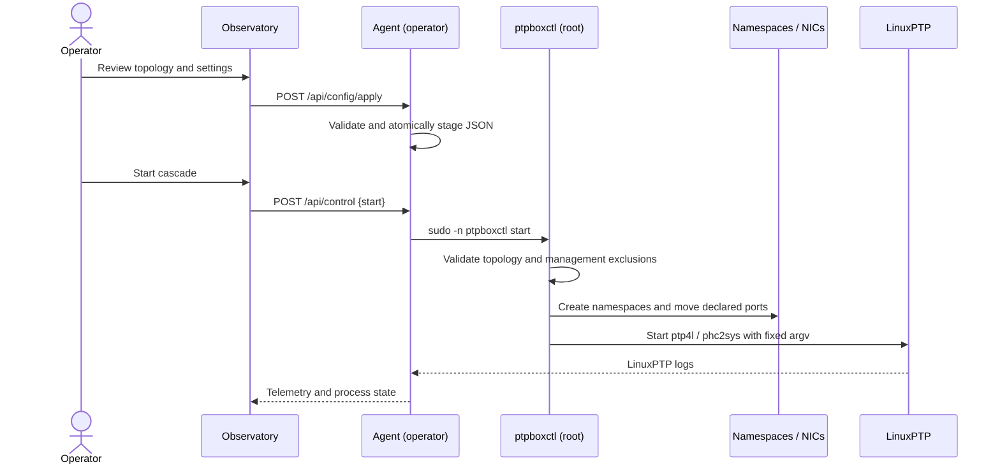

# Architecture

PTPBox separates product UI, unprivileged observation, and privileged data-plane
control. That separation keeps the common workflow safe while preserving the
ability to run a real multi-namespace PTP cascade.

## Components

### Precision Observatory

The React application in `app/` is a client-side instrument UI. It renders:

- the cascade and selected-clock detail;
- live or modeled offset traces on Canvas;
- stability and per-hop error analysis;
- experiment design and PI-servo tuning;
- interface/PHC inventory;
- guarded configuration review;
- event and session summaries.

It probes `http://<browser-host>:8090/api/status`. A query-string override is
available for development: `?agent=http://192.0.2.10:8090`.

The same component has two build targets:

- Vinext/Cloudflare output for the hosted demo;
- a Vite static bundle for the on-box Python agent.

### Host agent

`agent/ptpbox_agent.py` uses only the Python standard library. It runs as the
operator account and reads:

- `/sys/class/net` for link, driver, bus, MAC, speed, and PHC data;
- `ethtool -T` when sysfs does not expose a distinct PHC;
- `ip netns list` for namespace state;
- `ps` for active `ptp4l`, `phc2sys`, and `ts2phc` processes;
- raw LinuxPTP client logs in `/var/log/ptpbox`, with a legacy fallback below
  `PTPBOX_ROOT/BC*`, for offset, frequency adjustment, path delay, and servo
  state.

It also serves the standalone application and stages JSON configuration under
`PTPBOX_STATE_DIR`.

The browser requests an initial raw window and then polls incrementally with a
`since` cursor. Samples retain their LinuxPTP cadence and timestamp. Missing
samples are rendered as gaps; no moving average, interpolation, or synthetic
fill is applied in live mode.

### Lifecycle helper

`scripts/ptpboxctl.py` owns the privileged operations:

- validate interface and management-interface assignments;
- create/delete network namespaces;
- move/restore interfaces;
- start/stop LinuxPTP processes;
- generate role-specific `ptp4l` configuration;
- synchronize distinct PHCs with `phc2sys`;
- track child processes and logs.

The web sudo policy permits only `start`, `stop`, `restart`, and `status` with no
additional arguments. `setup` and `teardown` remain manual root operations.

## Data plane

The reference host's physically verified seven-node sequence is:

```text
BC1 → BC2 → BC7 → BC6 → BC5 → BC3 → BC4
GM       boundary clocks                    OC
```

The final BC4-to-BC1 cable closes the physical ring but carries no PTP process;
it is the deliberate logical break that prevents a timing loop.

Each node receives two physical ports. PTP is transported directly over Layer 2
by default, so the data-plane interfaces do not require IP addressing.

For intermediate nodes:

1. a client-only `ptp4l` instance disciplines the ingress PHC;
2. `phc2sys` transfers time from ingress PHC to egress PHC when they differ;
3. a server-only `ptp4l` instance serves the next hop.

If `ethtool -T` reports the same timestamp-provider index on both ports,
`phc2sys` is skipped because the ports already share one PHC.

## Control flow



## State and files

| Location | Owner | Lifetime | Contents |
| --- | --- | --- | --- |
| `PTPBOX_ROOT/runtime` | operator | durable | staged config, current experiment metadata |
| `/etc/ptpbox/topology.json` | root | durable | authoritative interface mapping |
| `/etc/ptpbox/config.json` | symlink | durable | points to staged operator config |
| `/run/ptpbox` | root | boot | PIDs and generated LinuxPTP config |
| `/var/log/ptpbox` | root | durable | one log per managed process |
| `/opt/ptpbox-web` | root | deployment | agent and static UI |

Configuration writes use a temporary sibling followed by an atomic replace.
Process spawning uses argument arrays rather than a shell.

## Telemetry modes

### Live

The agent is reachable and LinuxPTP logs contain parseable measurements. The UI
can replace modeled series with observed offset, frequency, and path delay.

### Observer

The agent is reachable and presents real hardware/process state, but the
cascade is not producing measurements. The UI uses deterministic model traces
and labels the session accordingly.

### Hosted model

The browser cannot reach a private agent. All host data and traces come from the
deterministic demonstration model. No control operation is attempted.

## Security boundaries

- The HTTP service is not a general remote shell.
- Configuration is validated and serialized as JSON.
- `ptpboxctl` never executes user-provided shell text.
- The controller refuses overlap between assigned and management interfaces.
- The systemd service uses `NoNewPrivileges`, `ProtectSystem=strict`,
  `ProtectHome=read-only`, and one explicit writable runtime path.
- Public exposure requires a separate authenticated TLS reverse proxy.

See [`SECURITY.md`](../SECURITY.md) for deployment policy.
